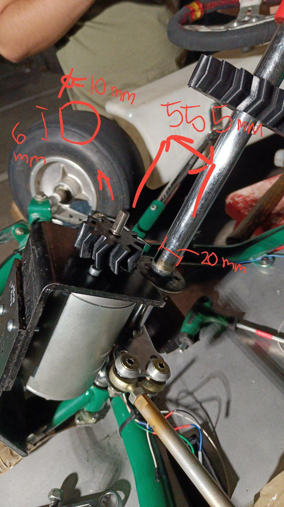
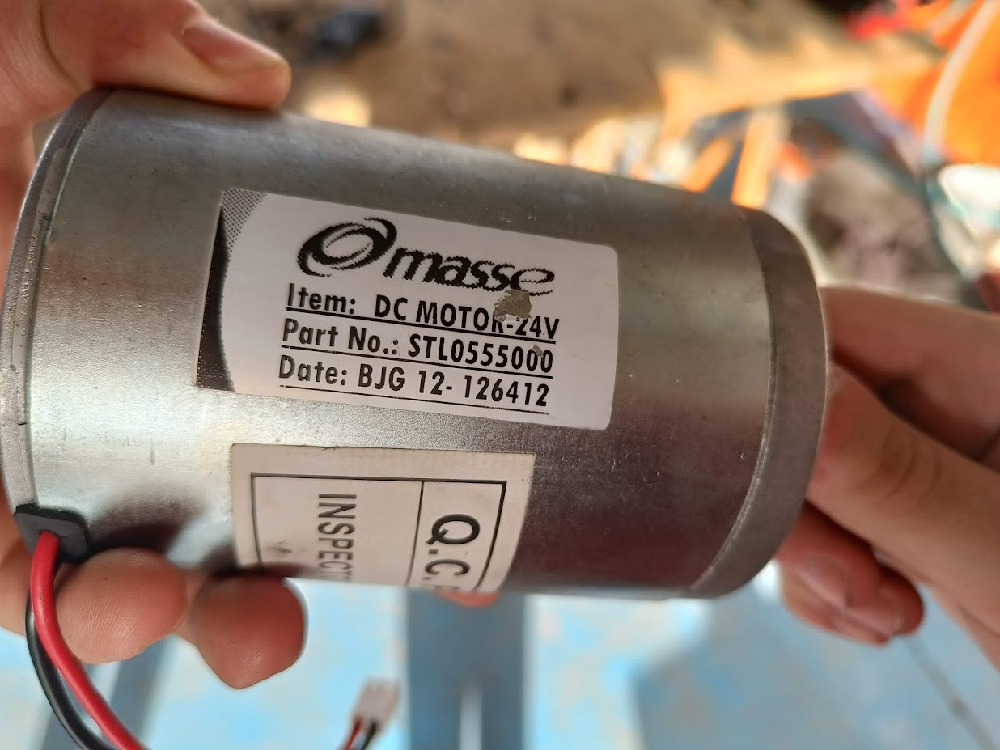

# Steering System

## Mechanical Overview

??? example "View steering mechanism with measurements"
    

The steering system uses a direct drive motor connected to the steering column. Key dimensions:
- Steering column diameter: 20mm
- Motor mount spacing: 50mm
- Connection diameter: 10mm (internal)

## Motor Data

24V motor, we will use it at 12V, estimated about 300W

## Main process
We need to move the steering shaft to the target angle.

1. Micro controller reads target position from main computer (Orin) and current position from the Hall effect sensor
    - Micro controller may be a Blue Pill, Teensy 4.0, or one with CAN transceiver builtin.
2. Calculates PWM % value with PID. Sends PWM 3.3V to H-bridge
3. H-bridge (MD30C) receives PWM and powers the DC motor
    - ChatGpt said it can't work with 3.3V PWM, just 5V PWM, but the datasheet says otherwise [here](../../assets/datasheets/MD30C%20Users%20Manual.pdf)

## H-bridge data
See [H-bridge](h-bridge.md) for more details.
