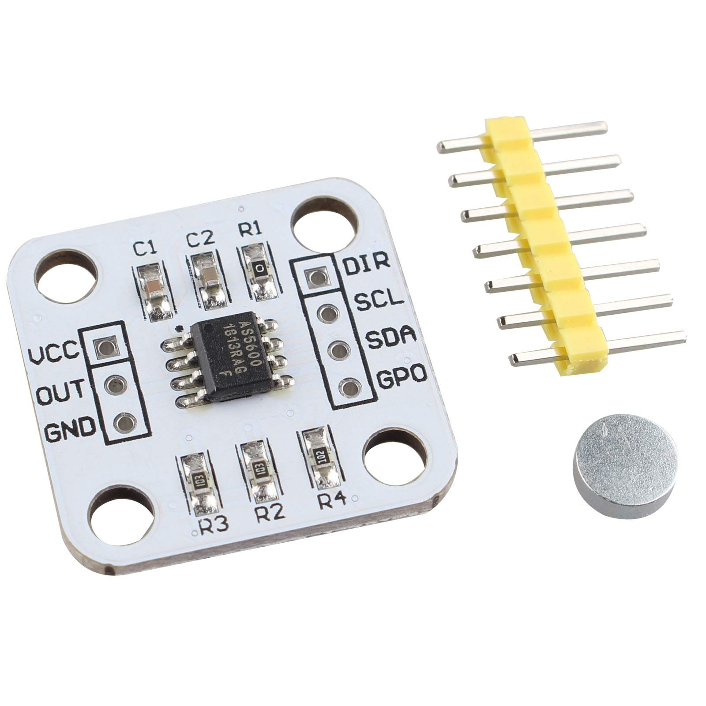

---
# BOM Entry
bom:
  component_id: "AS5600_MAGNETIC_ENCODER"
  part_number: "AS5600"
  category: "sensor"
  quantity: 1
  unit_cost: 2.00
  currency: "EUR"
  status: "active"
  criticality: "essential"
  suppliers:
    - name: "AliExpress"
      notes: "Various AS5600 breakout boards"
      verified: false
    - name: "Amazon"
      notes: "AS5600 magnetic encoder modules"
      verified: false
  specifications:
    resolution: "12-bit"
    interface: "I2C"
    voltage: "3.3V or 5V"
    magnetic_range: "360°"
  notes: "Works with diametrically magnetized magnet or normal magnet rotated 90°"
---

# Steering Angle Sensor

Sensor used is the cheap AS5600

Intended for use with a diametrically magnetized magnet, but works with a normal one turned 90 degrees too.
It may be a good idea to find bigger neodymium diametric magnets.

## AS5600 Wire Colors (2025 Temporary)

!!! warning "Temporary Color Code"
    This color code is specific to the 2025 version wiring and is not official. Verify connections before use.

| Color | Signal |
|-------|--------|
| Grey  | GND    |
| White | 3.3V   |
| Green | SDA    |
| Blue  | SCL    |

## Code Repository

Repo with basic code to read the steering angle sensor (Arduino HAL with VSCode Platformio, no IDE): https://github.com/rubenayla/bluepill-angle-arduino.git

