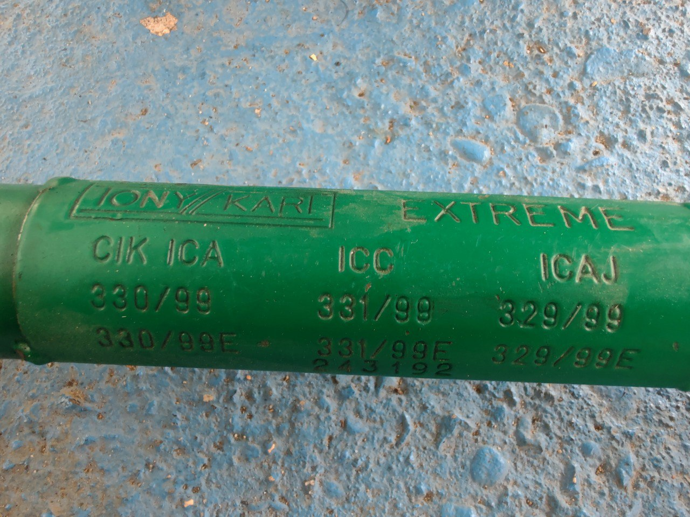

# Chassis

## Model Identification
Based on the frame markings (`TONY KART EXTREME`, `CIK ICA 330/99`), the chassis is identified as:

- **Make:** Tony Kart (OTK Kart Group)
- **Model:** Extreme
- **Era:** Late 90s / Early 2000s (1999 Homologation)
- **Type:** Competition Kart (ICA/ICC classes)
- **Tubing:** Green (Verde Tony), typically 30mm/32mm Chrome Moly tubing.
- **Axle:** 40mm (Confirmed by sprocket mount specs in powertrain docs).

## Setup Reference

### Tire Pressure
Tire pressure is determined by the **tire model**, not just the chassis. However, for a standard racing kart setup (~150kg total weight with driver/robot):

| Tire Type | Cold Pressure (Bar) | Cold Pressure (PSI) | Notes |
|-----------|---------------------|---------------------|-------|
| **Soft/Medium Slicks** | 0.75 ± 0.1 | ~11 ± 1.5 | Standard racing range (e.g., Vega Green/White) |
| **Hard Slicks** | 0.90 ± 0.1 | ~13 ± 1.5 | Endurance or rental compounds |
| **Rain Tires** | 1.20 ± 0.2 | ~17.5 ± 3 | Higher pressure to open treads |

> **Tip:** For autonomous runs, consistency is key. Start at **0.8 bar (11.6 psi)** all around and adjust based on tire wear and grip levels.

### Maintenance
- **Bearings:** Check rear axle bearings (3 per side usually) and front stub axle bearings.
- **Alignment:** The Extreme has adjustable caster/camber pills at the front kingpins. Neutral setting is recommended for initial autonomous testing.
