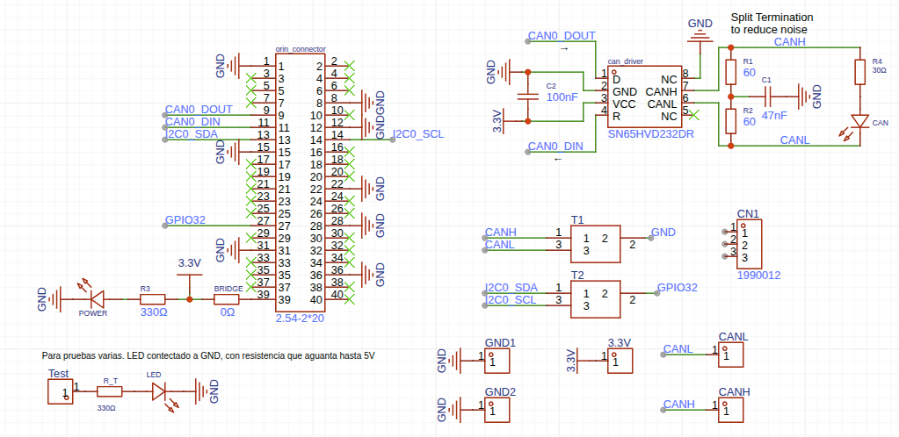
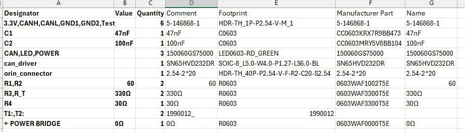
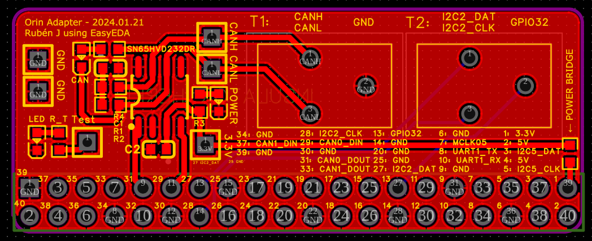
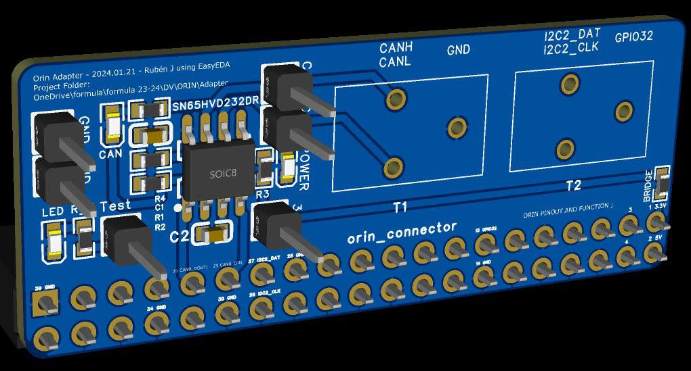

# Computer

The kart's onboard computer is an **NVIDIA Jetson AGX Orin Developer Kit**. It runs the ROS 2 stack:
perception, planning, control, and the dashboard. It does not touch the actuators directly — it
sends commands over USB serial to the [Kart Medulla](kart-medulla/index.md), which does.

Flashing, JetPack versions, NVMe boot and the whole software install are on the
[Orin Setup](orin-setup.md) page. This page covers the hardware: what the board is, how it is
powered, and the adapter board that connects it to the kart.

## Specifications

| | |
|---|---|
| CPU | 12-core ARM (aarch64), 62 GB RAM |
| GPU | Ampere, CUDA 12.6 |
| Storage | 57 GB eMMC (soldered, bootloader only) + 476 GB NVMe M.2 SSD (root filesystem) |
| Power mode | `MODE_50W` — the board defaults to 30 W and is deliberately switched up |

## Power

| | |
|---|---|
| Voltage range | 9–20 V DC, typically 19 V |
| Supplied from | The kart's 12 V rail — see [Battery](power/battery.md) |
| Connector | Barrel jack, 5.5 mm OD / 2.5 mm ID, centre positive |

Measured power draw under load has not been recorded yet; the 50 W power mode is the ceiling the
board is configured for, not a measurement.

## Reference links

- [Jetson AGX Orin Developer Kit user guide](https://developer.nvidia.com/embedded/learn/jetson-agx-orin-devkit-user-guide/developer_kit_layout.html)
- [NVIDIA Jetson downloads and datasheets](https://developer.nvidia.com/embedded/downloads)

## Orin adapter board (v1.0)

A small custom PCB that breaks the Orin's 40-pin header out to the kart. Designed in
[EasyEDA](https://easyeda.com/); project file
[here](computer/images/ProProject_Orin Adapter_2025-03-09.epro), also in the Owncloud folder at
`formula/formula 24-25/DV/ORIN/adapter/ProProject_Orin Adapter_2025-03-09.epro`.

What the schematic contains:

- **Power supply:** regulated 3.3 V and 5 V outputs.
- **CAN interface:** an SN65HVD232DR transceiver. **Fitted but unused** — the kart has no CAN bus;
  the Orin ↔ medulla link is USB serial.
- **Connector:** 2.54 mm 2×20 header to the Orin.
- **Filtering:** C1 (47 nF), C2 (100 nF).
- **Resistors:** R1, R2 (60 Ω), R3, R_T (330 Ω), R4 (30 Ω).
- **Test points:** T1, T2.

### Schematic



### Bill of materials



### Board





## Installing AnyDesk on the Orin

For remote desktop access to the Jetson:

```bash
wget -qO - https://keys.anydesk.com/repos/DEB-GPG-KEY | sudo apt-key add -
echo 'deb http://deb.anydesk.com/ all main' | sudo tee /etc/apt/sources.list.d/anydesk.list
sudo apt update
sudo apt install -y anydesk
```
