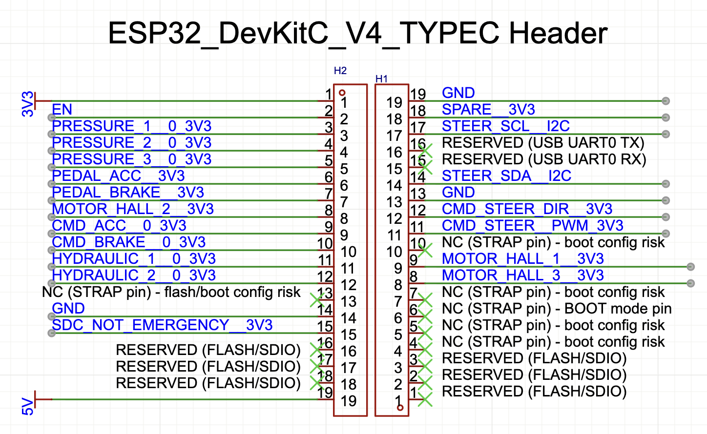
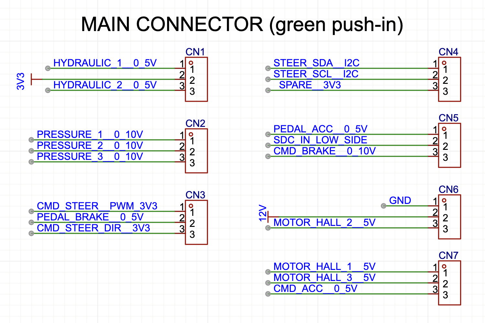
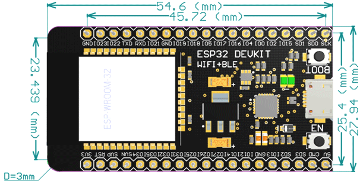

# Kart Medulla (ESP32)

The Kart Medulla is the ESP32-based control hub that interfaces between the Orin computer, sensors, and actuators. The standard board is the ESP32-DevKitC V4 (38-pin, USB-C) with an ESP32-WROOM-32D module; the older 30-pin board is legacy-only. The system is moving to a dedicated interface PCB that consolidates level shifting, analog conditioning, and IO breakout.

**Firmware repository:** [UM-Driverless/kart_medulla](https://github.com/UM-Driverless/kart_medulla)

## ESP32 Overview

*   **CPU:** Xtensa dual-core 32-bit LX6, up to 240 MHz
*   **Flash Memory:** Up to 16 MB
*   **SRAM:** 520 KB
*   **GPIOs:** 34
*   **ADCs:** 18-channel, 12-bit
*   **DACs:** 2-channel, 8-bit
*   **Communication Interfaces:** SPI, I2C, UART, CAN, I2S

## ESP32 Standardization Decision

The project previously used a 30-pin ESP32 development board with a non-standard pinout that is not DevKitC-compatible. To ensure long-term repeatability, predictable wiring, and easy replacement across builds, the project now standardizes on the ESP32-DevKitC V4 (38-pin, USB-C) using the ESP32-WROOM-32D module with an integrated PCB antenna. DevKitC V4 is Espressif's reference design with a stable pinout, reliable auto-reset/boot circuitry, and wide toolchain support. The 30-pin board remains deprecated and should not be used for new builds.

## Pin Assignment Table

Complete GPIO assignment for the ESP32-DevKitC V4, matching the interface PCB wiring. Header column refers to the physical pin on the DevKitC (H1 = left, H2 = right).

| GPIO | Header | Signal | Type | Description |
|------|--------|--------|------|-------------|
| 1 | H1-16 | USB_UART_TX | UART0 TX | USB serial TX (reserved, binary protocol to Orin) |
| 3 | H1-15 | USB_UART_RX | UART0 RX | USB serial RX (reserved, binary protocol from Orin) |
| 2 | H1-5 | STATUS_LED | Digital Out | Onboard LED (strap pin, keep LOW at boot) |
| 18 | H1-11 | CMD_STEER_PWM | LEDC PWM | Steering motor PWM (Cytron H-bridge) |
| 19 | H1-12 | CMD_STEER_DIR | Digital Out | Steering motor direction (Cytron H-bridge) |
| 21 | H1-14 | I2C_SDA | I2C | AS5600 steering angle sensor data |
| 22 | H1-17 | I2C_SCL | I2C | AS5600 steering angle sensor clock |
| 25 | H2-9 | CMD_ACC | DAC1 (0-255) | Throttle analog output |
| 26 | H2-10 | CMD_BRAKE | DAC2 (0-255) | Brake analog output |
| 27 | H2-11 | HYDRAULIC_1 | ADC2_CH7 | Hydraulic pressure sensor 1 |
| 14 | H2-12 | HYDRAULIC_2 | ADC2_CH6 | Hydraulic pressure sensor 2 |
| 32 | H2-7 | PEDAL_BRAKE | ADC1_CH4 | Brake pedal position |
| 33 | H2-8 | MOTOR_HALL_2 | Digital In | Motor hall sensor 2 |
| 34 | H2-5 | PRESSURE_3 | ADC1_CH6 | Pressure sensor 3 (input only) |
| 35 | H2-6 | PEDAL_ACC | ADC1_CH7 | Accelerator pedal position (input only) |
| 36 | H2-3 | PRESSURE_1 | ADC1_CH0 (VP) | Pressure sensor 1 (input only) |
| 39 | H2-4 | PRESSURE_2 | ADC1_CH3 (VN) | Pressure sensor 2 (input only) |
| 17 | H1-9 | MOTOR_HALL_1 | Digital In | Motor hall sensor 1 |
| 16 | H1-8 | MOTOR_HALL_3 | Digital In | Motor hall sensor 3 |
| 13 | H2-15 | SDC_NOT_EMERGENCY | Digital In | Shutdown circuit emergency status |

!!! warning "GPIO 17/16 Conflict"
    GPIO 17 and 16 are used for MOTOR_HALL_1 and MOTOR_HALL_3 on the interface PCB. These are also UART2 TX/RX pins. When using the PCB, UART2 debug logging is **not available**. Debug output must use USB UART0 or be disabled. In firmware, UART0 is reserved for the binary protocol to Orin, so debug logs are only available via UART2 when wiring directly (without the PCB).

!!! note "GPIO Restrictions"
    GPIO 6-11 are connected to SPI flash and must not be used. GPIO 34-39 are input-only.

## ESP32 Header Pinout (Physical Reference)

Mapping between the ESP32 38-pin numbering and the DevKitC V4 Type-C headers (H1/H2). ESP32 pins 1-19 correspond to H2 pins 1-19, and ESP32 pins 20-38 correspond to H1 pins 1-19.

| ESP32 Pin | H1 Pin | H2 Pin | Signal |
|-----------|--------|--------|--------|
| 1 | - | 1 | 3V3 |
| 2 | - | 2 | EN |
| 3 | - | 3 | PRESSURE_1_0_3V3 |
| 4 | - | 4 | PRESSURE_2_0_3V3 |
| 5 | - | 5 | PRESSURE_3_0_3V3 |
| 6 | - | 6 | PEDAL_ACC_3V3 |
| 7 | - | 7 | PEDAL_BRAKE_3V3 |
| 8 | - | 8 | MOTOR_HALL_2_3V3 |
| 9 | - | 9 | CMD_ACC_0_3V3 |
| 10 | - | 10 | CMD_BRAKE_0_3V3 |
| 11 | - | 11 | HYDRAULIC_1_0_3V3 |
| 12 | - | 12 | HYDRAULIC_2_0_3V3 |
| 13 | - | 13 | NC (STRAP pin - flash/boot config risk) |
| 14 | - | 14 | GND |
| 15 | - | 15 | SDC_NOT_EMERGENCY_3V3 |
| 16 | - | 16 | RESERVED (FLASH/SDIO) |
| 17 | - | 17 | RESERVED (FLASH/SDIO) |
| 18 | - | 18 | RESERVED (FLASH/SDIO) |
| 19 | - | 19 | 5V |
| 20 | 1 | - | RESERVED (FLASH/SDIO) |
| 21 | 2 | - | RESERVED (FLASH/SDIO) |
| 22 | 3 | - | RESERVED (FLASH/SDIO) |
| 23 | 4 | - | NC (STRAP pin - boot config risk) |
| 24 | 5 | - | NC (STRAP pin - boot config risk) |
| 25 | 6 | - | NC (STRAP pin - BOOT mode pin) |
| 26 | 7 | - | NC (STRAP pin - boot config risk) |
| 27 | 8 | - | MOTOR_HALL_3_3V3 |
| 28 | 9 | - | MOTOR_HALL_1_3V3 |
| 29 | 10 | - | NC (STRAP pin - boot config risk) |
| 30 | 11 | - | CMD_STEER_PWM_3V3 |
| 31 | 12 | - | CMD_STEER_DIR_3V3 |
| 32 | 13 | - | GND |
| 33 | 14 | - | STEER_SDA_I2C |
| 34 | 15 | - | RESERVED (USB UART0 RX) |
| 35 | 16 | - | RESERVED (USB UART0 TX) |
| 36 | 17 | - | STEER_SCL_I2C |
| 37 | 18 | - | SPARE_3V3 |
| 38 | 19 | - | GND |

## Kart Medulla Interface PCB (In Progress)

The interface PCB (a.k.a. `esp32_expander` in the repo) hosts the electrical conditioning and connectors so the ESP32 module can be swapped while keeping wiring consistent.

### Draft Hardware Decisions

- Shutdown: use a MOSFET (N-channel low-side or P-channel high-side).
- Analog outputs: use ESP32 DACs with a dual op-amp for gain (x1.5 to 5V throttle, x3 to ~9.99V Festo pressure sensor).

### Connector Pinout (Outside World)

The main connector is a set of green push-in headers labeled CN1..CN4 in the schematic.

| Connector | Pin | Signal | Notes |
|-----------|-----|--------|-------|
| CN1 | 1 | HALL3_5V | |
| CN1 | 2 | HALL2_5V | |
| CN1 | 3 | HALL1_5V | |
| CN2 | 1 | PRESSURE1_0V10 | |
| CN2 | 2 | PRESSURE2_0V10 | |
| CN2 | 3 | PRESSURE3_0V10 | |
| CN3 | 1 | GND | |
| CN3 | 2 | STEER_CMD_DIR_3.3V | |
| CN3 | 3 | STEER_CMD_PWM_3.3V | |
| CN4 | 1 | 3.3V | |
| CN4 | 2 | STEER_SDA | |
| CN4 | 3 | STEER_SCL | |

## Other

### ESP32-DevKitC Dimensions

