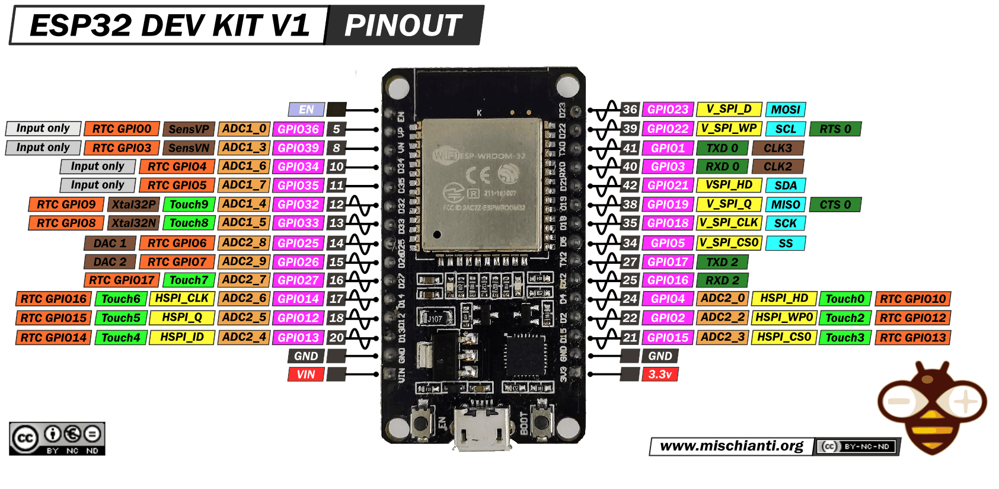
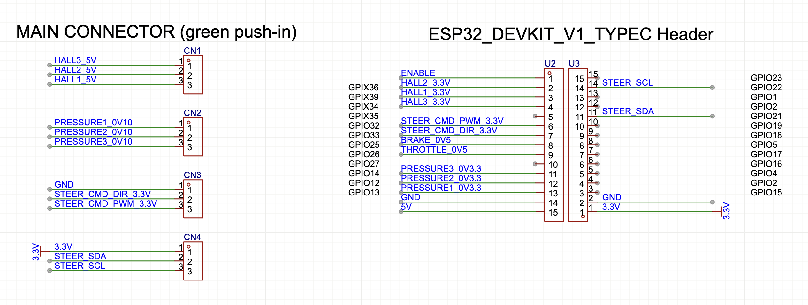

# Kart Medulla (ESP32)

The Kart Medulla is the ESP32-based control hub that interfaces between the Orin computer, sensors, and actuators. It currently uses an ESP32-DevKitC V4 module and is moving to a dedicated interface PCB that consolidates level shifting, analog conditioning, and IO breakout.

**Firmware repository:** [UM-Driverless/kart_medulla](https://github.com/UM-Driverless/kart_medulla)

## ESP32 Overview

*   **CPU:** Xtensa dual-core (or single-core) 32-bit LX6 microprocessor
*   **Clock Speed:** Up to 240 MHz
*   **Wi-Fi:** 802.11 b/g/n
*   **Bluetooth:** Bluetooth v4.2 BR/EDR and BLE
*   **Flash Memory:** Up to 16 MB
*   **SRAM:** 520 KB
*   **GPIOs:** 34
*   **ADCs:** 18-channel, 12-bit
*   **DACs:** 2-channel, 8-bit
*   **Communication Interfaces:** SPI, I2C, UART, CAN, I2S

### ESP32-DevKitC Dimensions

## Current ESP32-DevKitC V4 Configuration

The ESP32-DevKitC V4 (with ESP32-WROOM-32 module) serves as the medulla of the kart, interfacing between the Orin computer, steering angle sensor, and motor controllers.

### Pin Assignments

#### Motor Control Outputs

| GPIO Pin | Function    | Type    | Range   | Description |
|----------|-------------|---------|---------|-------------|
| GPIO 26  | Throttle    | DAC2    | 0-255   | Analog throttle control |
| GPIO 25  | Brake       | DAC1    | 0-255   | Analog brake control |
| GPIO 27  | Steering PWM| LEDC    | 0-255   | Steering motor PWM |
| GPIO 14  | Steering DIR| Digital | 0/1     | Steering motor direction |

#### Sensor Interface (AS5600)

| GPIO Pin | Function | Connected To | Description |
|----------|----------|--------------|-------------|
| GPIO 22  | I2C SCL  | AS5600 SCL   | Clock signal |
| GPIO 21  | I2C SDA  | AS5600 SDA   | Data signal |

!!! note "AS5600 Status"
    The AS5600 magnetic angle sensor remains disabled in firmware until hardware is physically connected.

#### Auxiliary Pins

| GPIO Pin | Function     | Connected To | Description |
|----------|--------------|--------------|-------------|
| GPIO 2   | Status LED   | Onboard LED  | Status indicator |
| GPIO 18  | UART TX      | Orin RX      | Serial communication to Orin |
| GPIO 19  | UART RX      | Orin TX      | Serial communication from Orin |

## Wiring Connections

### ESP32 to AS5600 Angle Sensor

| AS5600 Pin | ESP32 Pin | Wire Color (2025) |
|------------|-----------|-------------------|
| SCL        | GPIO 22   | Blue |
| SDA        | GPIO 21   | Green |
| VCC        | 3.3V      | White |
| GND        | GND       | Grey |

!!! warning "Temporary Color Code"
    Wire colors are specific to the 2025 version and not official. Always verify connections.

### ESP32 to Motor Controllers

#### Throttle Control

| Motor Driver Pin | ESP32 Pin | Signal Type |
|------------------|-----------|-------------|
| Analog Input     | GPIO 26   | DAC2 (0-255)|
| VCC              | 5V        | Power       |
| GND              | GND       | Ground      |

#### Brake Control

| Motor Driver Pin | ESP32 Pin | Signal Type |
|------------------|-----------|-------------|
| Analog Input     | GPIO 25   | DAC1 (0-255)|
| VCC              | 5V        | Power       |
| GND              | GND       | Ground      |

#### Steering Control

| Steering Driver Pin | ESP32 Pin | Signal Type |
|---------------------|-----------|-------------|
| PWM                 | GPIO 27   | LEDC (0-255)|
| DIR                 | GPIO 14   | Digital (0/1)|
| VCC                 | 5V        | Power       |
| GND                 | GND       | Ground      |

### ESP32 to Orin (UART Communication)

| Orin Pin | ESP32 Pin | Direction |
|----------|-----------|-----------|
| RX       | GPIO 18   | ESP32 -> Orin |
| TX       | GPIO 19   | Orin -> ESP32 |
| GND      | GND       | Ground |

!!! info "UART Configuration"
    Serial communication enables future integration between the Orin computer and ESP32 for command/telemetry exchange.

## Kart Medulla Interface PCB (In Progress)

The interface PCB (a.k.a. `esp32_expander` in the repo) hosts the electrical conditioning and connectors so the ESP32 module can be swapped while keeping wiring consistent.

!!! warning "Draft Pinout"
    Pin mappings below are transcribed from the schematic screenshot and still in flux. Blank entries indicate missing or unclear labels.

### Draft Hardware Decisions

- Shutdown: use a MOSFET (N-channel low-side or P-channel high-side).
- Analog outputs: use ESP32 DACs with a dual op-amp for gain (x1.5 to 5V throttle, x3 to ~9.99V Festo pressure sensor).

### Connector Pinout (Outside World)

The main connector is a set of green push-in headers labeled CN1..CN4 in the schematic.

| Connector | Pin | Signal | Notes |
|-----------|-----|--------|-------|
| CN1 | 1 | HALL3_5V | |
| CN1 | 2 | HALL2_5V | |
| CN1 | 3 | HALL1_5V | |
| CN2 | 1 | PRESSURE1_0V10 | |
| CN2 | 2 | PRESSURE2_0V10 | |
| CN2 | 3 | PRESSURE3_0V10 | |
| CN3 | 1 | GND | |
| CN3 | 2 | STEER_CMD_DIR_3.3V | |
| CN3 | 3 | STEER_CMD_PWM_3.3V | |
| CN4 | 1 | 3.3V | |
| CN4 | 2 | STEER_SDA | |
| CN4 | 3 | STEER_SCL | |

### ESP32 Header Pinout (Software Names)

Mapping between the ESP32-DevKitC header pins and the signal names used in software. The GPIO labels are taken from the schematic; missing items remain blank.

| ESP32 Header | Pin | GPIO | Signal | Notes |
|-------------|-----|------|--------|-------|
| U2 | 1 |  | ENABLE | |
| U2 | 2 | GPIO36 | HALL2_3.3V | |
| U2 | 3 | GPIO39 | HALL1_3.3V | |
| U2 | 4 | GPIO34 | HALL3_3.3V | |
| U2 | 5 | GPIO35 |  | |
| U2 | 6 | GPIO32 | STEER_CMD_PWM_3.3V | |
| U2 | 7 | GPIO33 | STEER_CMD_DIR_3.3V | |
| U2 | 8 | GPIO25 | BRAKE_0V5 | |
| U2 | 9 | GPIO26 | THROTTLE_0V5 | |
| U2 | 10 | GPIO27 |  | |
| U2 | 11 | GPIO14 | PRESSURE3_0V3.3 | |
| U2 | 12 | GPIO12 | PRESSURE2_0V3.3 | |
| U2 | 13 | GPIO13 | PRESSURE1_0V3.3 | |
| U2 | 14 |  | GND | |
| U2 | 15 |  | 5V | |
| U3 | 1 |  | 3.3V | |
| U3 | 2 |  | GND | |
| U3 | 3 | GPIO15 |  | |
| U3 | 4 | GPIO2 |  | |
| U3 | 5 | GPIO4 |  | |
| U3 | 6 | GPIO16 |  | |
| U3 | 7 | GPIO17 |  | |
| U3 | 8 | GPIO5 |  | |
| U3 | 9 | GPIO18 |  | |
| U3 | 10 | GPIO19 |  | |
| U3 | 11 | GPIO21 | STEER_SDA | |
| U3 | 12 | GPIO2 |  | |
| U3 | 13 | GPIO1 |  | |
| U3 | 14 | GPIO22 | STEER_SCL | |
| U3 | 15 | GPIO23 |  | |
