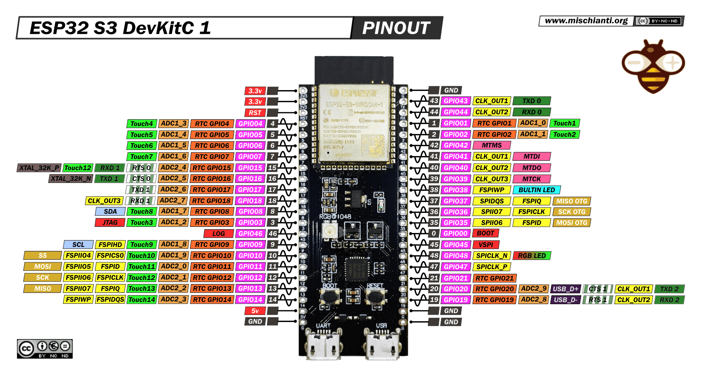

# Kart Medulla (ESP32-S3)

The Kart Medulla is the MCU-based control hub between the Orin computer and the kart's sensors and actuators. The next revision is an interface PCB built around the **ESP32-S3**, with external level shifting, analog conditioning, an SPI DAC, an on-PCB manual/autonomous signal mux, and Wago-style push-in connectors replacing the hand-wired Dupont setup.

!!! info "Currently hand-wired in the kart: classic ESP32"
    The kart is currently running a hand-wired classic-ESP32 (no PCB). That setup is documented on the [Legacy wiring](legacy-wiring.md) page and will be removed once the ESP32-S3 board is deployed.

**Firmware repository:** [UM-Driverless/kart_medulla](https://github.com/UM-Driverless/kart_medulla)

## Why ESP32-S3

The classic ESP32 ran out of usable GPIOs once CAN, SPI, status RGB, buzzer, and the Orin link were added on top of the existing I/O (3× halls, 3× pressure, accelerator, brake, SDC, steering, relay). The S3 solves this and adds several quality-of-life wins:

- **~45 GPIOs** (vs ~34 on the classic), with fewer of them reserved or strap-pin traps.
- **Native USB-OTG** — the Orin link becomes a direct USB cable (CDC-ACM), dropping the USB-UART bridge IC and moving from ~1 Mbit/s UART to ~12 Mbit/s full-speed USB.
- **Built-in USB-Serial-JTAG** — flashing, serial monitor, and step-debugging all over the same USB cable. No external ESP-Prog / FT2232H needed.
- **External DAC on the PCB** (MCP4922, dual 12-bit, SPI) — replaces the classic ESP32's built-in 8-bit DAC. 12-bit resolution × 2 channels covers `CMD_ACC` (accelerator, 0–5 V direct) and `CMD_BRAKE` (brake, 0–5 V → ×2 op-amp → 0–10 V for the Festo proportional valve) with no extra pin cost beyond the existing SPI bus.

Variants considered and rejected: **S2** (has DAC but single-core, no BT), **C3** (too few GPIOs), **C6** (no DAC, Wi-Fi 6 overkill for a kart), **H2** (no Wi-Fi).

## ESP32-S3 Overview

*Click the image for the full high-resolution pinout and specs page at [mischianti.org](https://mischianti.org/esp32-s3-devkitc-1-high-resolution-pinout-and-specs/).*

- **CPU:** Xtensa dual-core 32-bit LX7, up to 240 MHz
- **GPIOs:** ~45 usable
- **ADCs:** 2× 12-bit, multi-channel
- **DACs:** none (external MCP4922 dual 12-bit SPI DAC on the interface PCB)
- **USB:** native USB-OTG + USB-Serial-JTAG
- **Wireless:** Wi-Fi 4 + BLE 5
- **Communication Interfaces:** SPI, I²C, UART, CAN (TWAI), I²S

## Dev-board mechanical reference (ESP32-S3-DevKitC-1)

The medulla PCB hosts the ESP32-S3 module via a stock **ESP32-S3-DevKitC-1** dev board (or a pin-compatible clone such as the YD-ESP32-S3 / "44 pines tipo C"). The medulla footprint must match this:

| Quantity | Value |
|---|---|
| Pin pitch (within a row) | **2.54 mm** (0.1 ″) |
| Pins per row | **22** (44 total — 2 rows of female sockets) |
| **Row centerline ↔ row centerline** | **22.86 mm** (0.9 ″) |
| PCB outer width | 25.40 mm (= 22.86 + 2 × 1.27 mm edge offset) |
| USB-C protrusion past board edge | ~8.00 mm |

**The row spacing is 22.86 mm (0.9 ″), NOT 25.40 mm.** Pin centerlines are inset 1.27 mm from each PCB edge. This was confirmed by physical caliper measurement on an official Espressif board on 2026-05-02 after two earlier wrong PDF-derived answers — the Espressif `DXF_…_V1.1_20220429.pdf` mechanical drawing has ambiguous `1.27 mm` callouts that can be read as either antenna keepout or pin-row offset. **Trust the physical measurement, not any single drawing.** Local mirrors of the Espressif drawing, schematic, and the ground-truth measurement photo are kept in the dv vault at `dv/kart/kart-medulla/resources/esp32-s3-devkitc-1/`.

## ESP32-S3 Pin Assignment

Pin map for the ESP32-S3 module on the interface PCB. H1 is the left header, H2 is the right header. **Source of truth:** `dv/kart/kart-medulla/pinout-esp32-s3.md` in the DV Drive vault — this table mirrors that file. Pin numbers (1–44) follow a chip-style counter-clockwise convention starting from the bottom-right.

| Pin | Header | GPIO | Signal | Type | Notes |
|-----|--------|------|--------|------|-------|
| 1 | H1.1 | – | 3V3 | Power | 3.3 V supply (generated by S3 module LDO from 5 V input) |
| 2 | H1.2 | – | 3V3 | Power | 3.3 V supply |
| 3 | H1.3 | – | RST | Reset | Reset pin |
| 4 | H1.4 | 4 | PEDAL_ACC | ADC1_CH3 | Accelerator pedal (input only) |
| 5 | H1.5 | 5 | PEDAL_BRAKE | ADC1_CH4 | Brake pedal |
| 6 | H1.6 | 6 | PRESSURE_1 | ADC1_CH5 | Festo pressure sensor 1 (24 V via divider) |
| 7 | H1.7 | 7 | PRESSURE_2 | ADC1_CH6 | Festo pressure sensor 2 (24 V via divider) |
| 8 | H1.8 | 15 | MUX_SELECT | Digital Out | Drives both MAX4660 SELECT pins (manual/autonomous mux). 10 kΩ pulldown to GND on this net so hardware default = manual passthrough. |
| 9 | H1.9 | 16 | MOTOR_HALL_1 | Digital In | Motor hall sensor 1 (moved from GPIO 37 for octal-PSRAM-module compatibility) |
| 10 | H1.10 | 17 | TX1 | UART1 | UART1 TX |
| 11 | H1.11 | 18 | RX1 | UART1 | UART1 RX |
| 12 | H1.12 | 8 | I2C_SDA | I²C | AS5600 steering angle sensor data |
| 13 | H1.13 | 3 | BUZZER | Digital Out | Debug/status buzzer (strap pin: JTAG src select, default-high; idle-high at boot is acceptable. Moved from GPIO 36 for octal-PSRAM compatibility) |
| 14 | H1.14 | 46 | RESERVED | – | Strap pin (flash/boot risk) |
| 15 | H1.15 | 9 | I2C_SCL | I²C | AS5600 steering angle sensor clock |
| 16 | H1.16 | 10 | HYDRAULIC_1 | ADC1_CH9 | Hydraulic pressure sensor 1 (input only) |
| 17 | H1.17 | 11 | MOSI | SPI | SPI data out (→ MCP4922 SDI) |
| 18 | H1.18 | 12 | CLK | SPI | SPI clock (→ MCP4922 SCK) |
| 19 | H1.19 | 13 | MISO | SPI | SPI data in |
| 20 | H1.20 | 14 | CMD_DAC_CS | SPI | MCP4922 chip select (active low) |
| 21 | H1.21 | – | 5V | Power | 5 V input from kart-wide XW-1224 rail (or on-board LM2596 buck) |
| 22 | H1.22 | – | GND | Power | Ground |
| 23 | H2.1 | – | GND | Power | Ground |
| 24 | H2.2 | 43 | TX0 | UART0 | UART0 TX (debug) |
| 25 | H2.3 | 44 | RX0 | UART0 | UART0 RX (debug) |
| 26 | H2.4 | 1 | PRESSURE_3 | ADC1_CH0 | Festo pressure sensor 3 (24 V via divider) |
| 27 | H2.5 | 2 | HYDRAULIC_2 | ADC1_CH1 | Hydraulic pressure sensor 2 (input only) |
| 28 | H2.6 | 42 | CAN_TX | CAN (TWAI) | CAN bus TX |
| 29 | H2.7 | 41 | CAN_RX | CAN (TWAI) | CAN bus RX |
| 30 | H2.8 | 40 | CMD_STEER_PWM | LEDC PWM | Steering motor PWM (Cytron H-bridge) |
| 31 | H2.9 | 39 | SDC_ENABLE | Digital Out | Shutdown circuit relay drive (active to enable drive) |
| 32 | H2.10 | 38 | SDC_STAT | Digital In | Shutdown circuit status readback |
| 33 | H2.11 | 37 | SPARE | – | Octal-PSRAM pin on R8 modules — leave free for module-variant compatibility |
| 34 | H2.12 | 36 | SPARE/CMD_REVERSE | Digital Out (open-drain) | Reverse signal to motor electronics, in parallel with manual reverse button. Configure as `GPIO_MODE_OUTPUT_OD` in firmware — never push-pull. Octal-PSRAM pin on R8: this assignment is N8R2-only and would have to be dropped on an R8 module (kart loses autonomous reverse, manual button still works via wired-OR through the motor controller's pull-up). The `SPARE/` prefix flags that the function is droppable. |
| 35 | H2.13 | 35 | SPARE | – | Octal-PSRAM pin on R8 modules — leave free for module-variant compatibility |
| 36 | H2.14 | 0 | CMD_STEER_DIR | Digital Out | Steering motor direction (Cytron H-bridge) — strap pin (BOOT mode), pulled high externally; SDC keeps drive disabled at boot so the brief glitch is harmless. Moved from GPIO 35 for octal-PSRAM compatibility. |
| 37 | H2.15 | 45 | RESERVED | – | Strap pin (flash/boot risk) |
| 38 | H2.16 | 48 | LED | PWM | RGB status LED |
| 39 | H2.17 | 47 | MOTOR_HALL_2 | Digital In | Motor hall sensor 2 (5 V → 3.3 V level-shifted) |
| 40 | H2.18 | 21 | MOTOR_HALL_3 | Digital In | Motor hall sensor 3 (5 V → 3.3 V level-shifted) |
| 41 | H2.19 | 20 | USB_D+ | USB | Native USB-OTG to Orin (D+) |
| 42 | H2.20 | 19 | USB_D- | USB | Native USB-OTG to Orin (D-) |
| 43 | H2.21 | – | GND | Power | Ground |
| 44 | H2.22 | – | GND | Power | Ground |

!!! note "CMD_ACC and CMD_BRAKE go through the external SPI DAC"
    The classic ESP32 exposed `CMD_ACC` on a dedicated DAC pin. On the S3 there is no native DAC — both `CMD_ACC` and `CMD_BRAKE` are generated by the **MCP4922** (dual 12-bit SPI DAC, see hardware decisions below) and ride the existing SPI bus (CS = GPIO 14). Channel A → `CMD_ACC` (0–5 V direct), Channel B → `CMD_BRAKE` → ×2 op-amp → 0–10 V for the Festo proportional brake valve.

!!! note "GPIO restrictions (ESP32-S3)"
    Strap/boot pins on the S3 — notably GPIO 0, 3, 45, 46 — must be left at safe levels at reset; the table notes mark which assignments are constrained by this. On WROOM-1 modules some of GPIO 26–32 are tied to the SPI flash internally (always reserved). GPIO 33–37 are reserved by **octal PSRAM** on R8 variants (see the danger block below).

!!! danger "Module suffix: N8R2 — octal-PSRAM variants (R8) are BANNED"
    The ordered part is **ESP32-S3-WROOM-1-N8R2** (8 MB flash, 2 MB quad PSRAM). **Do not substitute an R8 variant** (e.g. N16R8), even if the plan is to "ignore" the extra PSRAM in firmware.

    On R8 modules, the 8 MB octal PSRAM is **hard-wired inside the module package** to GPIO 33–37 (SPI0/1 extension pins). Espressif's ESP32-S3-WROOM-1 datasheet marks those pins as **not available** on R8 variants. This is a physical constraint: disabling PSRAM in `sdkconfig` does NOT reclaim the pins — the PSRAM die is still electrically attached to those traces, and driving them externally risks bus contention during boot.

    **Our pinout treats GPIO 33, 35, 37 as SPARE** so that an R8 module *would* physically fit (courtesy compatibility), and keeps the assigned-but-droppable signal (`CMD_REVERSE` on GPIO 36) flagged as `SPARE/CMD_REVERSE` to make the loss obvious. That is **not** an endorsement of R8 — the module standard remains N8R2, and any move to R8 requires re-auditing the pinout.

    **Valid upgrade path if 8 MB flash isn't enough: N16R2** (16 MB flash, 2 MB quad PSRAM) — zero pinout change, zero GPIO cost. **Not N16R8.**

    See the dv vault `kart/kart-medulla/history.md` (2026-04-23, 2026-04-29) for full reasoning.

## Kart Medulla Interface PCB

Interface PCB hosting the ESP32-S3 module, signal conditioning, the SPI DAC, the manual/autonomous analog mux, and outside-world connectors. Design lineage (EasyEDA `.epro` project files) lives in the Drive folder `formula_24-25-26/dv/kart/kart-medulla/project-backups/`.

### Hardware Decisions

- **Shutdown circuit (SDC):** GPIO 39 (`SDC_ENABLE`) drives a normally-open relay that breaks the SDC if firmware decides; GPIO 38 (`SDC_STAT`) reads the SDC state back. Exact relay part: TE 1462043-3 (see `dv/kart/kart-medulla/resources.md`).
- **Analog command outputs (`CMD_ACC`, `CMD_BRAKE`):** external **MCP4922-E/SL** — dual 12-bit SPI DAC. On the existing SPI bus (CS = GPIO 14). VREF tied to the 5 V rail through a 100 Ω + 10 µF RC filter to attenuate ~150 kHz switching ripple from the upstream XW-1224 buck. Channel A → `CMD_ACC` 0–5 V direct; Channel B → `CMD_BRAKE` → ×2 op-amp → 0–10 V for the **Festo proportional brake valve**. Decision history: 2026-04-13 (initial choice was MCP4728 I²C) → 2026-04-17 (switched to MCP4922 SPI because we already had MCP4922 chips on hand and SPI is cleaner for an analog-command bus shared with no other slow devices).
- **Manual/autonomous signal mux (decision 2026-05-01):** **2× MAX4660EUA+T** SPDT analog switches on the PCB mux throttle and brake between the manual signal source and the ESP32 DAC outputs. SELECT pins of both chips are tied to a single ESP32 GPIO (`MUX_SELECT`, GPIO 15) with a 10 kΩ pulldown to GND, so the **hardware default is manual passthrough** whenever the ESP32 is crashed, hung, resetting, or unbooted. **Reverse is NOT muxed via MAX4660** — it uses an ESP32 GPIO in **open-drain** mode (`SPARE/CMD_REVERSE` on GPIO 36) wired in parallel with the manual reverse button (wired-OR via the motor controller's existing pull-up). **Steering is NOT muxed at all** — the ESP32 always drives the Cytron H-bridge directly; in manual mode firmware sets PWM = 0. Replaces the panel-mount toggle that failed in service.
- **Cytron H-bridge (steering driver) power (decision 2026-05-01):** powered **permanently from kart 12 V** — NOT switched through the manual/autonomous mode switch. The Cytron's inrush capacitors were browning out the Orin every time the kart was switched into autonomous. The PCB only routes signals (`CMD_STEER_PWM`, `CMD_STEER_DIR`) to the Cytron, not power.
- **REVERSE-signal driver to the kart electronics box (U12, decision 2026-04-26):** swapping **PC357N1J000F optocoupler → BSS123 N-channel logic-level MOSFET** (SOT-23) in the next schematic edit. Reason: medulla GND and box GND are bonded through several paths (USB ↔ Orin, signals ↔ Cytron, motor return ↔ battery), so the opto's isolation is moot — MOSFET is cheaper, smaller, faster, and doesn't age. Board not yet manufactured, swap is free. Drives the box's REVERSE wire (5 V via ~60 kΩ internal pull-up; pull to 0 V to engage reverse).
- **Pressure sensor inputs (3× Festo, 24 V):** voltage divider + input clamp / TVS protection on each channel to bring the signal into the S3's ADC range (≤ 3.3 V).
- **Hydraulic pressure sensor inputs (2×):** routed to ADC1_CH9 (GPIO 10) and ADC1_CH1 (GPIO 2).
- **Hall sensor inputs (3× 5 V):** dedicated level translator (NOT the optocoupler) to 3.3 V before the GPIO pins.
- **Orin link:** native USB-OTG on GPIO 19/20 (D∓). No USB-UART bridge chip.
- **Power architecture:** kart 12 V → external XW-1224 buck → 5 V kart-wide rail → medulla 5 V (H1.21) → ESP32-S3 module LDO → 3.3 V. The medulla can alternatively be powered from an on-board LM2596SX-ADJ buck (qty 8 in stock) if the kart-wide 5 V rail is unavailable. MCP4922 VDD and MAX4660 Vcc both run from the same 5 V rail.

### Connector Pinout (Outside World)

The main connector is a set of green push-in headers labeled CN1..CN4 in the schematic. Signal names follow the [Net Name Nomenclature](../net-naming.md) convention.

| Connector | Pin | Signal | Notes |
|-----------|-----|--------|-------|
| CN1 | 1 | MOTOR_HALL_3__5V | Motor hall sensor 3 (5 V, level-shifted on PCB) |
| CN1 | 2 | MOTOR_HALL_2__5V | Motor hall sensor 2 (5 V, level-shifted on PCB) |
| CN1 | 3 | MOTOR_HALL_1__5V | Motor hall sensor 1 (5 V, level-shifted on PCB) |
| CN2 | 1 | PRESSURE_1__24V | Festo pressure sensor 1 (24 V, divided + clamped on PCB) |
| CN2 | 2 | PRESSURE_2__24V | Festo pressure sensor 2 (24 V, divided + clamped on PCB) |
| CN2 | 3 | PRESSURE_3__24V | Festo pressure sensor 3 (24 V, divided + clamped on PCB) |
| CN3 | 1 | GND | |
| CN3 | 2 | CMD_STEER_DIR__3V3 | Steering direction command |
| CN3 | 3 | CMD_STEER__PWM_3V3 | Steering PWM command (to Cytron H-bridge) |
| CN4 | 1 | 3V3 | |
| CN4 | 2 | I2C_STEER_SDA__I2C | AS5600 steering angle sensor data |
| CN4 | 3 | I2C_STEER_SCL__I2C | AS5600 steering angle sensor clock |
