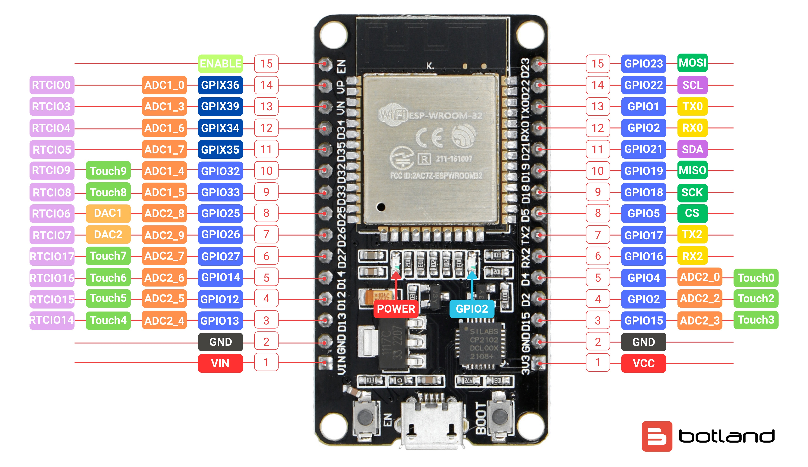

# ESP32

The ESP32 is a series of low-cost, low-power system on a chip microcontrollers with integrated Wi-Fi and dual-mode Bluetooth. The ESP32 series employs a Tensilica Xtensa LX6 microprocessor in both dual-core and single-core variations and includes built-in antenna switches, RF balun, power amplifier, low-noise receive amplifier, filters, and power management modules.

## Key Features

*   **CPU:** Xtensa dual-core (or single-core) 32-bit LX6 microprocessor
*   **Clock Speed:** Up to 240 MHz
*   **Wi-Fi:** 802.11 b/g/n
*   **Bluetooth:** Bluetooth v4.2 BR/EDR and BLE
*   **Flash Memory:** Up to 16 MB
*   **SRAM:** 520 KB
*   **GPIOs:** 34
*   **ADCs:** 18-channel, 12-bit
*   **DACs:** 2-channel, 8-bit
*   **Communication Interfaces:** SPI, I2C, UART, CAN, I2S

## Kart Medulla - ESP32-DevKitC V4 Configuration

The ESP32-DevKitC V4 (with ESP32-WROOM-32 module) serves as the "medulla" of the kart, interfacing between the Orin computer, steering angle sensor, and motor controllers.

**Firmware Repository:** [UM-Driverless/kart_medulla](https://github.com/UM-Driverless/kart_medulla)

### Pin Assignments

#### Motor Control Outputs

| GPIO Pin | Function    | Type    | Range   | Description |
|----------|-------------|---------|---------|-------------|
| GPIO 26  | Throttle    | DAC2    | 0-255   | Analog throttle control |
| GPIO 25  | Brake       | DAC1    | 0-255   | Analog brake control |
| GPIO 27  | Steering PWM| LEDC    | 0-255   | Steering motor PWM |
| GPIO 14  | Steering DIR| Digital | 0/1     | Steering motor direction |

#### Sensor Interface (AS5600)

| GPIO Pin | Function | Connected To | Description |
|----------|----------|--------------|-------------|
| GPIO 22  | I2C SCL  | AS5600 SCL   | Clock signal |
| GPIO 21  | I2C SDA  | AS5600 SDA   | Data signal |

!!! note "AS5600 Status"
    The AS5600 magnetic angle sensor remains disabled in firmware until hardware is physically connected.

#### Auxiliary Pins

| GPIO Pin | Function     | Connected To | Description |
|----------|--------------|--------------|-------------|
| GPIO 2   | Status LED   | Onboard LED  | Status indicator |
| GPIO 18  | UART TX      | Orin RX      | Serial communication to Orin |
| GPIO 19  | UART RX      | Orin TX      | Serial communication from Orin |

## Wiring Connections

### ESP32 to AS5600 Angle Sensor

| AS5600 Pin | ESP32 Pin | Wire Color (2025) |
|------------|-----------|-------------------|
| SCL        | GPIO 22   | Blue |
| SDA        | GPIO 21   | Green |
| VCC        | 3.3V      | White |
| GND        | GND       | Grey |

!!! warning "Temporary Color Code"
    Wire colors are specific to the 2025 version and not official. Always verify connections.

### ESP32 to Motor Controllers

#### Throttle Control

| Motor Driver Pin | ESP32 Pin | Signal Type |
|------------------|-----------|-------------|
| Analog Input     | GPIO 26   | DAC2 (0-255)|
| VCC              | 5V        | Power       |
| GND              | GND       | Ground      |

#### Brake Control

| Motor Driver Pin | ESP32 Pin | Signal Type |
|------------------|-----------|-------------|
| Analog Input     | GPIO 25   | DAC1 (0-255)|
| VCC              | 5V        | Power       |
| GND              | GND       | Ground      |

#### Steering Control

| Steering Driver Pin | ESP32 Pin | Signal Type |
|---------------------|-----------|-------------|
| PWM                 | GPIO 27   | LEDC (0-255)|
| DIR                 | GPIO 14   | Digital (0/1)|
| VCC                 | 5V        | Power       |
| GND                 | GND       | Ground      |

### ESP32 to Orin (UART Communication)

| Orin Pin | ESP32 Pin | Direction |
|----------|-----------|-----------|
| RX       | GPIO 18   | ESP32 → Orin |
| TX       | GPIO 19   | Orin → ESP32 |
| GND      | GND       | Ground |

!!! info "UART Configuration"
    Serial communication enables future integration between the Orin computer and ESP32 for command/telemetry exchange.
