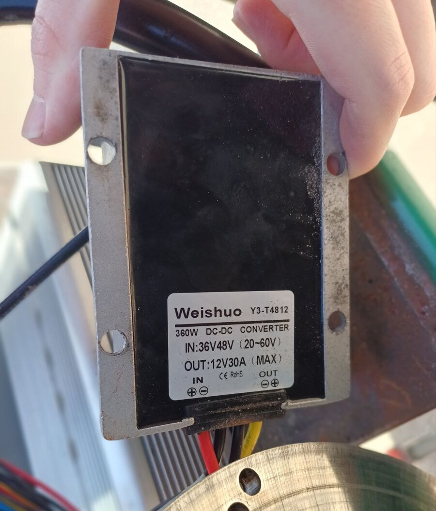
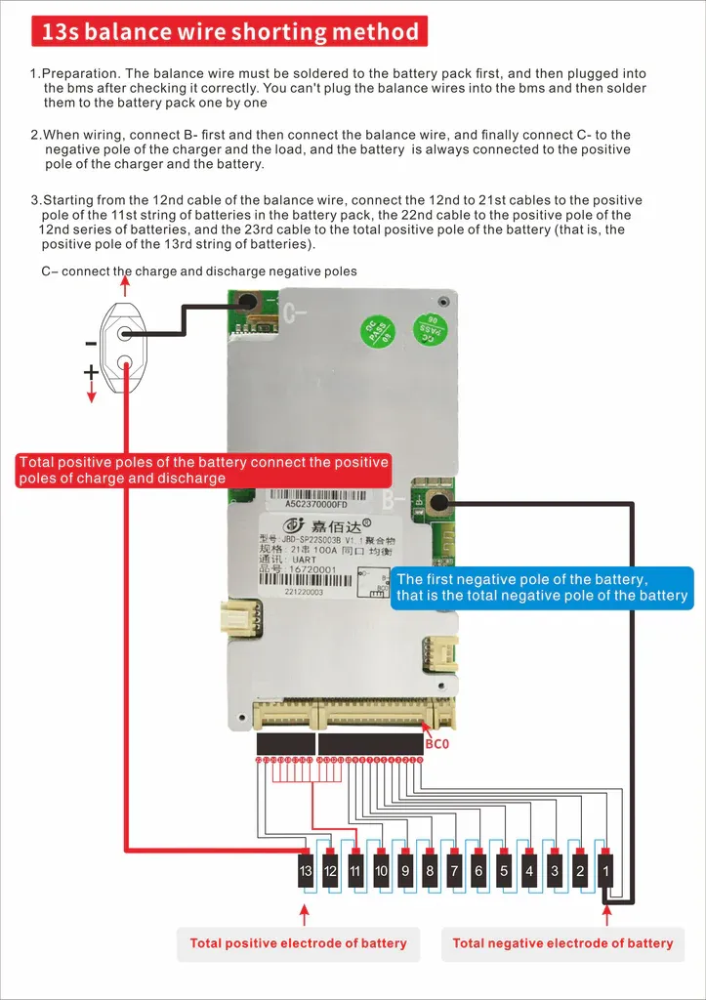

# Battery

> To charge the battery with a bench power supply, see this tutorial: [Cómo Cargar una Batería de Litio con una Fuente](https://youtu.be/g1jsSbjsiTo?si=uZ7mVjXA2c-43zzz)

The main pack uses **Molicel P42A** cells in a 13S4P configuration, providing a nominal voltage of about 48 V. The 12 V rail that powers the sensors and low-voltage electronics is stepped down from the pack by the DC-DC converter below; this replaced the separate 12 V battery the kart used earlier to stay compatible with the Formula Student car.

For battery placement rationale see the [FAQ](../../../faq.md#battery).

| Parameter | Value |
|-----------|-------|
| BMS Cutoff voltage | 39.0 V (13 * 3.0V) |
| Configuration | 13S4P (13 cells in series, 4 in parallel) |
| Nominal voltage | 46.8 V (13 * 3.6 V) — standard 48 V system label |
| Maximum charging voltage | 54.6 V (13 * 4.2V) |
| Minimum voltage | 41.6 V (13 * 3.2V) |
| Power Capacity | 786 Wh (3.6V * 4.2 Ah * 13 * 4) |
| Charge capacity | 16.8 Ah (4 * 4200 mAh) |
| Maximum continuous discharge current | 180 A (4 * 45 A. 9828W at 100% charge!!) |
| Maximum continuous charge current | 32 A (4 * 8 A. about 1.7kW) |
| Cell type | Molicel P42A |
| Cell capacity | 4200 mAh (4.2 Ah) |
| Cell nominal voltage | 3.6 V (per Molicel INR-21700-P42A datasheet) |
| Cell maximum voltage | 4.2 V |
| Cell minimum voltage | 3.2 V |

## 48 V → 12 V converter

The 12 V rail is generated from the 48 V traction pack by a **Weishuo Y3-T4812** step-down (buck) DC-DC converter. There is no separate 12 V battery — this converter replaced the previous 12 V lead-acid aux battery (see the [full BOM](../../../bom/full.md)). Everything on 12 V hangs off it: the pneumatic Festo pressure sensors (via a 12 → 24 V boost) and the downstream 12 → 5 V / 3.3 V bucks. The steering H-bridge is **not** on this rail — the Cytron is fed straight from the 48 V pack.

{ width=400 }

| Parameter | Value |
|-----------|-------|
| Model | Weishuo Y3-T4812 |
| Type | Step-down (buck) DC-DC converter |
| Rated power | 360 W |
| Input voltage | 36 V / 48 V nominal (20–60 V range) |
| Output voltage | 12 V |
| Output current | 30 A max |
| Terminal polarity | IN ⊕⊖, OUT ⊖⊕ (marked on the label) |

The 13S4P pack operates at roughly 41.6–54.6 V, well inside the converter's 20–60 V input window.

## BMS
- Jiabaida BMS, 100A BT UART, NMC 6S-21S
- https://www.notion.so/BMS-Bater-a-Kart-JBD-16078747314380e68688c3ab787fc1f7?pvs=21
- https://es.aliexpress.com/item/1005007223779359.html

!!! note "Software: reading the BMS"
    The Jetson Orin reads this BMS over **Bluetooth LE** (no ESP32, no CAN) and publishes it as a ROS `BatteryState` topic that drives the dashboard battery gauge. See the [BMS (battery node)](../../../software/ros2/bms.md) software page for the `kb_bms` node and the JBD BLE protocol.

