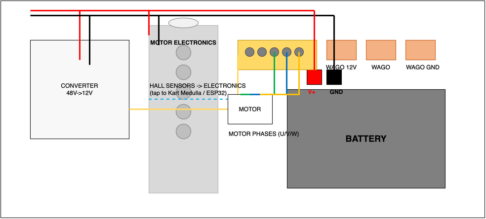

# Wiring
TODO global diagram.

## Power entry diagram

## Net naming

For signal naming across PCBs, see [Net Name Nomenclature](net-naming.md).

## Throttle pedal sensor

For throttle pedal sensor specifications and wiring, see [Throttle Pedal Documentation](../powertrain/throttle-pedal.md).

## ESP32 wiring

For detailed ESP32 wiring connections including AS5600 sensor, motor driver, and Orin communication, see [Kart Medulla Documentation](kart-medulla/index.md#wiring-connections).
