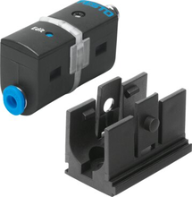
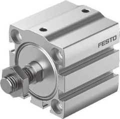
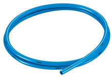

# Pneumatics
We need an emergency braking system that can be activated on loss of electrical power or error from the shutdown loop, and a proportional braking system that can be controlled by the main computer when the robot is running.

Two circuit variants are documented here. The **simplified design** is the minimum viable circuit; the **full design** adds extra isolation for maximum redundancy. The [BOM](bom.md) covers the full design (simplified is a subset).

## Simplified Design

VPPM and EBS in parallel, directly to the actuator. No ASB isolation valve, no OR valve. This works because the VPPM blocks all ports when unpowered (see [VPPM analysis](#vppm-unpowered-behavior-what-does-unregulated-mean) below).

<object data="images/ebs-simplified.svg" type="image/svg+xml" style="width:100%;max-width:1200px;"></object>

Source: [`images/ebs-simplified.drawio`](images/ebs-simplified.drawio)

> **Tip:** Click any component in the diagram to open its Festo product page. Yellow dots are CK compression fittings; blue lines are tubing.

## Full Design (ASB + OR valve)

Adds an **ASB isolation valve** ([8035167](https://www.festo.com/es/es/a/8035167/)) in series before the VPPM and an **OR/shuttle valve** ([6682](https://www.festo.com/es/es/a/6682/)) to merge the EBS and VPPM outputs. This provides additional isolation: if the VPPM were to develop a seal leak over time, the ASB valve cuts its supply on power loss, and the OR valve prevents backflow from the EBS line through the VPPM exhaust.

<object data="images/ebs-full.svg" type="image/svg+xml" style="width:100%;max-width:1300px;"></object>

Source: [`images/ebs-full.drawio`](images/ebs-full.drawio)

### Component References (Links)

The diagrams use plain-English labels. When possible, we link to **local PDFs** in this repo; vendor links may require login or be blocked.

Terminology:

- `SDE5` is the Festo product family name for our pressure sensors. In the diagram we call them "Pressure sensor (tank side)" and "Pressure sensor (regulated side)".
- `NPFC-T` is a threaded T-adapter with 3x G1/4 female ports (replaces the old push-in TCK-1/4). Each port needs a CK-1/4 compression fitting.

| Component | Photo | Max pressure | BOM section | Local docs | Vendor link |
|---|---|---|---|---|---|
| Compressor + tank (6 L) |  | 90-120 psi (6.2-8.3 bar) | [`Compressor & Tank`](bom.md#compressor-tank) |  | [VEVOR](https://www.vevor.es/bocina-aire-comprimido-c_11496/vevor-compresor-de-aire-para-kit-de-bocina-90-120-psi-bomba-de-aire-con-tanque-de-6-l-para-inflar-neumaticos-colchones-de-aire-compatible-con-todos-los-vehiculos-de-12-v-trenes-barcos-coches-taller-p_010247980894) |
| Pressure sensor (tank side) |  | **10 bar** (measurement range) | [`Pressure Sensor 1`](bom.md#pressure-sensor-1-tank-side-before-regulator) | [`567465datasheet.pdf`](../../assets/datasheets/567465datasheet.pdf) | [Festo](https://www.festo.com/es/es/a/567465/) |
| Manual ball valve (release/isolation) |  | — | [`Manual Valve`](bom.md#manual-valve-brake-release-isolation) |  |  |
| Pressure regulator (D7) |  | 0.5-12 bar output | [`Low-Pressure Regulator`](bom.md#low-pressure-regulator) | [`527690datasheet.pdf`](../../assets/datasheets/527690datasheet.pdf) | [Festo](https://www.festo.com/es/es/a/527690/) |
| Pressure sensor (regulated side) |  | **10 bar** (measurement range) | [`Pressure Sensor 2`](bom.md#pressure-sensor-2-regulated-side-before-valves) | [`567465datasheet.pdf`](../../assets/datasheets/567465datasheet.pdf) | [Festo](https://www.festo.com/es/es/a/567465/) |
| NPFC-T threaded T-adapter |  | — | [`Compression Fittings`](bom.md#compression-fittings) |  | [Festo](https://www.festo.com/es/es/a/8030236/) |
| EBS solenoid valve (VUVS) |  | **10 bar** operating | [`EBS Electrovalve`](bom.md#ebs-electrovalve-emergency-braking) | [`575488datasheet.pdf`](../../assets/datasheets/575488datasheet.pdf) | [Festo](https://www.festo.com/es/es/a/8035174/) |
| ASB isolation valve (VUVS) *(full design only)* |  | **10 bar** operating | [`ASB Electrovalve`](bom.md#asb-electrovalve-vppm-supply-isolation) |  | [Festo](https://www.festo.com/es/es/a/8035167/) |
| OR / shuttle valve *(full design only)* |  | — | [`Shuttle Valve`](bom.md#shuttle-valve-or-valve) |  | [Festo](https://www.festo.com/es/es/a/6682/) |
| ASB proportional valve (VPPM) |  | **11 bar** inlet | [`VPPM Proportional Valve`](bom.md#vppm-proportional-valve-asb) | [`205274_documentation.pdf`](../../assets/datasheets/205274_documentation.pdf), [`VPPM_en.pdf`](../../assets/datasheets/VPPM_en.pdf) | [Festo](https://www.festo.com/es/es/a/571293/) |
| Brake actuator (ADN) |  | **10 bar** (50mm bore) | [`Pneumatic Actuator`](bom.md#pneumatic-actuator) | [`adn-s-enus.pdf`](../../assets/datasheets/adn-s-enus.pdf) | [Festo](https://www.festo.com/gb/en/a/8084714/) |
| Exhaust silencers (G1/4 + G1/8) |  | — | [`Silencers`](bom.md#silencers) | [`2316datasheet.pdf`](../../assets/datasheets/2316datasheet.pdf) | [Festo G1/4](https://www.festo.com/es/es/a/2316/), [Festo G1/8](https://www.festo.com/es/es/a/2307/) |
| Tubing + fittings |  | 10 bar (tubing) | [`Tubing`](bom.md#tubing), [`Compression Fittings`](bom.md#compression-fittings) | [`197384datasheet.pdf`](../../assets/datasheets/197384datasheet.pdf), [`2029datasheet.pdf`](../../assets/datasheets/2029datasheet.pdf), [`4469datasheet.pdf`](../../assets/datasheets/4469datasheet.pdf) | Tubing: [Festo](https://www.festo.com/es/es/a/197384/), CK: [Festo](https://www.festo.com/es/es/a/2029/), NPFC-T: [Festo](https://www.festo.com/es/es/a/8030236/), LCK: [Festo](https://www.festo.com/es/es/a/4469/) |

> **Max system pressure: 10 bar.** The weakest downstream components (VUVS valves, SDE5 sensors, ADN-S actuator) are rated to 10 bar. The VPPM inlet accepts up to 11 bar. The D7 regulator can output up to 12 bar — **never set it above 10 bar** or downstream components may be damaged. The D6 variant only reaches 7 bar (too low); there is no MS4-LR variant capping at exactly 10 bar, so the D7 is necessary but requires care when adjusting.

### VPPM unpowered behavior: what does "unregulated" mean?

For our emergency braking system, we need to know exactly what the VPPM proportional valve does when it loses power. The Festo datasheet uses the word **"unregulated"**, which is ambiguous. Here we break down what it actually means, based on multiple pieces of evidence from the official documentation.

**Sources:**

- Festo VPPM catalog documentation 205274 ([local](../../assets/datasheets/205274_documentation.pdf) | [online](https://www.festo.com/media/catalog/205274_documentation.pdf))
- Festo VPPM-8L-L-1-G14-0L10H-V1P-S1C1 datasheet, part 571293 ([local](../../assets/datasheets/VPPM_en.pdf) | [online](https://www.festo.com/us/en/a/571293/))

#### Evidence from the datasheets

| Evidence | Location | Implication |
|---|---|---|
| Valve function: **"3-way proportional-pressure regulator, closed"** | 205274, page 2, "Valve function" table | The valve's default state is "closed" |
| Type code position 006: **"1 = 3/2-way valve, normally closed"** | 205274, page 4, type code table | Confirms the de-energized state is "closed" |
| **"Pressure is maintained if the controller fails"** | 205274, page 2, "Operationally safe" section | Output pressure does NOT vent to exhaust |
| **"Safety position VPPM: if the power supply cable is interrupted, output pressure is maintained unregulated."** | 571293 datasheet, page 1, "Safety instructions" row | No active regulation, but pressure is _maintained_ |
| Design: **"Piloted diaphragm regulator"** | Both datasheets | Piloted = a small solenoid controls a larger diaphragm |
| Type of reset: **"Mechanical spring"** | Both datasheets | Spring returns the diaphragm to its rest (closed) position |

#### Interpretation

The VPPM is a **piloted diaphragm regulator** with a **mechanical spring return**. When powered, the electronic controller actively modulates the pilot solenoid to regulate output pressure by opening/closing the supply (1→2) and exhaust (2→3) paths. When power is lost:

1. The pilot solenoid de-energizes
2. The mechanical spring returns the diaphragm to its rest position
3. **All three ports are isolated from each other** (normally closed)

The word **"maintained"** is the critical clue:

- If port 2→3 (exhaust) were open, pressure would vent and _not_ be maintained
- If port 1→2 (supply) were open, pressure would _rise_ to supply pressure, not just be "maintained"
- "Maintained" means: pressure stays at whatever value it was at the moment of power loss

So **"unregulated"** means: the pressure at port 2 is no longer actively controlled, but it is trapped there. It will only decay slowly through natural seal leakage over time.

#### Consequence for our circuit

Since all ports are blocked when unpowered, we are in the **second-best scenario** for emergency braking. We need **one additional valve in parallel** (the EBS electrovalve) to bypass the VPPM and deliver full supply pressure to the brake actuator when power is lost.

This is the basis for the **simplified design** above. The **full design** adds the ASB valve and OR valve as extra safety margins: even if VPPM seals degrade over time, the ASB valve cuts its supply and the OR valve prevents backflow.

### Alternative scenarios and required valves

Depending on the valve's unpowered behavior, different circuit designs would be required. This section documents all cases for reference.

#### Best case: Port 1→2 connected when unpowered

If the valve passed supply pressure straight through to the output when de-energized, full supply pressure would reach the brake actuator automatically on power loss. **No additional valves would be needed** — the VPPM itself would provide emergency braking.

#### Our case: All ports blocked when unpowered

This is the VPPM's actual behavior. Port 2 holds its last pressure but receives no supply and doesn't vent.

**Simplified design** requires:

- **One valve in parallel** (normally-open solenoid valve, e.g., the EBS electrovalve): bypasses the VPPM to deliver full supply pressure for emergency braking when power is lost.

That's it — no other valves are needed because neither the supply nor the exhaust path leaks through the VPPM.

**Full design** adds (for extra redundancy):

- **ASB isolation valve** (normally-closed solenoid) in series before the VPPM: cuts supply to VPPM on power loss, preventing any potential degraded-seal leakage.
- **OR / shuttle valve** between the parallel outputs and the actuator: ensures EBS pressure cannot backflow through the VPPM path.

#### If output leaked to exhaust (port 2→3 leak)

If air leaked from the output to the exhaust port when unpowered, the emergency braking line would slowly lose pressure through the VPPM's port 3. We would need:

- **One valve in parallel** (normally-open solenoid): same as above, to deliver supply pressure for emergency braking.
- **One shuttle valve / OR valve** (ball type, e.g., Festo OS-1/4-B): placed between the parallel valve's output and the brake actuator. The ball blocks the path back toward port 2 of the VPPM, preventing emergency air from leaking out through the VPPM's exhaust.

This is essentially the **full design** — which is why it provides protection even against seal degradation.

#### Worst case: Both supply and exhaust paths leak (ports 1↔2 and 2↔3)

If the VPPM allowed air to flow through both paths when unpowered, emergency braking air could leak in two directions: backward through port 1 to the supply, and forward through port 3 to atmosphere. We would need:

- **One valve in series** (normally-closed solenoid) on the supply line before the VPPM's port 1: prevents emergency air from flowing backward through the VPPM to the supply tank.
- **One shuttle valve / OR valve** (ball type): same as above, prevents air from leaking out through the VPPM's exhaust port 3.
- **One valve in parallel** (normally-open solenoid) routed to the OR valve inlet: delivers supply pressure for emergency braking, merged with the VPPM line via the shuttle valve.

Again, the **full design** covers this case: the ASB valve acts as the series isolation, and the OR valve prevents backflow.

### [Bill of Materials](bom.md)

---

## Historical Archive
The [Original "Conservative" Design](diego-design.md) (Diego's Design) included an additional solenoid valve for ASB isolation. This was initially deemed redundant after confirming the VPPM blocks all ports when unpowered, leading to the simplified design. The full design re-introduces these components for maximum redundancy.
