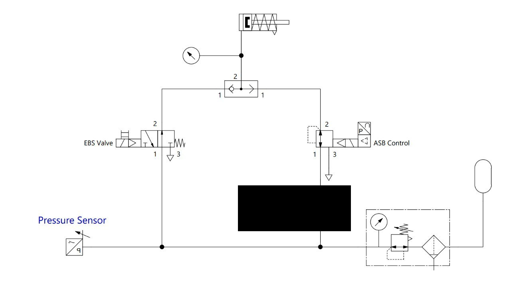

# Pneumatics
We need an emergency braking system that can be activated on loss of electrical power or error from the shutdown loop, and a proportional braking system that can be controlled by the main computer when the robot is running.

## Final Simplified Design
We have validated a simplified design that removes the redundant ASB isolation valve, relying on the intrinsic behavior of the Proportional Valve (VPPM) and the Shuttle Valve (OR logic).

### How it works

1.  **Normal Driving (ASB Control):**
    *   **EBS Valve:** Unpowered (Closed to tank, Vents line). *Note: Standard EBS valves are usually Normally Open for fail-safe, but in this specific diagram configuration, check if EBS valve is being used to supply or vent.*
    *   **VPPM (ASB Control):** Powered. It regulates pressure (0-10 bar) from the tank to the Shuttle Valve.
    *   **Shuttle Valve:** Passes the VPPM pressure to the cylinder to retract the brake (if using a fail-safe spring cylinder) or apply it (if using active braking). *Wait, the context implies fail-safe spring braking where pressure = release.*

    > **Correction on Logic based on standard FS rules:**
    > *   **Fail-Safe Brake:** Spring extends (Brakes ON). Pressure retracts (Brakes OFF).
    > *   **EBS State:** 0 bar in system -> Spring extends -> Emergency Brake.
    > *   **Driving State:** High pressure (>4 bar) -> Cylinder retracts -> Brakes Released.

    **Revised Logic for this Diagram:**
    *   **EBS Valve:** Must be energized to allow pressure (Normal driving) or de-energized to vent?
    *   **Shuttle Valve (OR):** Selects the higher pressure source.

    **Why the "ASB Valve" was removed:**
    The original design had a valve before the VPPM to cut its air. This is unnecessary because:
    1.  **Port 1 (Supply) Seals:** When the VPPM loses power, it closes the supply port. It does not drain the air tank.
    2.  **Port 2 (Output) Vents:** When unpowered, the VPPM connects Output to Exhaust. It effectively becomes a 0-bar source.
    3.  **Safety:** As long as the Shutdown Circuit cuts power to **both** the EBS Valve and the VPPM, the VPPM will not feed false pressure into the system.

### States

| State | Power | EBS Valve | VPPM (ASB) | Shuttle Output | Result |
| :--- | :--- | :--- | :--- | :--- | :--- |
| **Emergency (EBS)** | **OFF** | Vents to Atm | Vents to Atm | 0 bar | Spring extends (**BRAKE**) |
| **Driving** | **ON** | Supplied (10 bar) | Controlled | 10 bar | Cylinder Retracts (Release) |
| **Active Braking** | **ON** | Closed/Venting? | Modulated | Modulated | Controlled Braking |

> **Critical Component: Shuttle Valve (OR)**
> The Shuttle Valve is mandatory. You cannot simply T-connect the lines. If you did, the unpowered VPPM (which vents to atmosphere) would act as a massive leak for the EBS line, preventing the system from ever building pressure to release the brakes. The Shuttle Valve isolates the venting VPPM from the pressurized EBS line (or vice versa).

## Components
- [Solenoid valve](https://www.festo.com/tw/en/a/575488/) (Emergency)
- [Proportional Valve](https://www.festo.com/es/es/a/8153644/) (ASB Control)
- [Shuttle Valve](https://www.festo.com/es/es/a/6682/) (OR Logic)
- Pressure sensor
