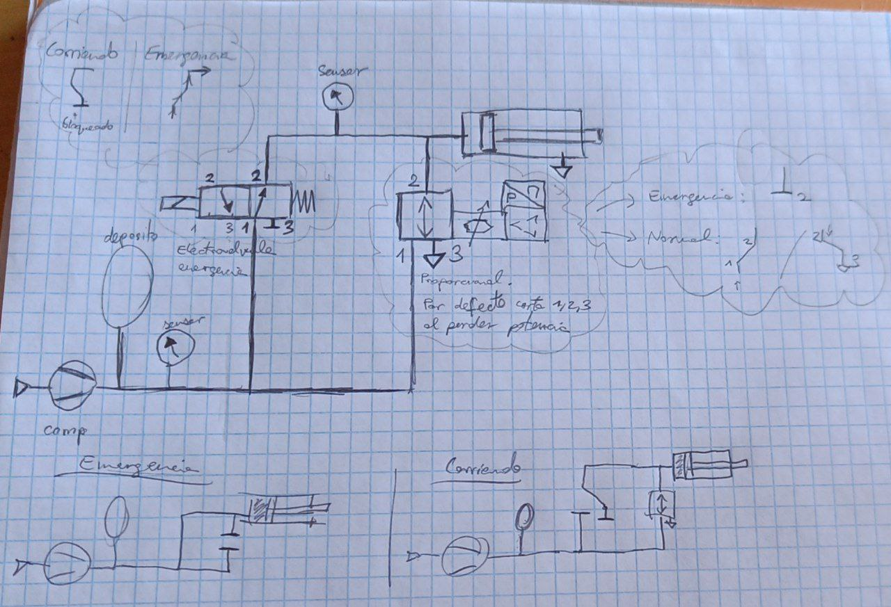

# Pneumatics
We need an emergency braking system that can be activated on loss of electrical power or error from the shutdown loop, and a proportional braking system that can be controlled by the main computer when the robot is running.

TODO redesign circuit with the valves we have, instead of using two different ones. 

TODO order components: proportional valve, adapters to have no problems using any of our tanks, pressure sensors, 

> Original Idea:
> Use a ball valve to merge the proportional braking line with the emergency one, and an extra electrovalve to stop flow to the proportional valve when emergency.

## Simplified design (TODO simulate it)
If the proportional valve does close both ways when not powered, we can get rid of the valve that goes in series with it. If we close port 3 of the emergency electrovalve, we can get rid of the valve with the ball at the top.

## Components
- [Solenoid valve](https://www.festo.com/tw/en/a/575488/)
    > For emergency braking
    - [Datasheet local](../../assets/datasheets/575488datasheet.pdf)
    - [Datasheet online](https://www.festo.com/tw/en/a/download-document/datasheet/575488)
    - G1/4 female thread
- [Proportional Valve](https://www.festo.com/es/es/a/8153644/)
    > For normal controlled braking
    - TODO CONSIDER AN 8-PIN M16 PROPORTIONAL VALVE SO WE CAN USE IT AS PRESSURE SENSOR
    - [Datasheet online](https://www.festo.com/es/es/a/download-document/datasheet/8153644)
    - [Datasheet local](../../assets/datasheets/8153644datasheet.pdf)
    - [206533 documentation](../../assets/datasheets/206533_documentation.pdf)
    - TODO QUESTION: Can we get the reading of pressure from this valve? There are some that allow it
- Fittings:
    - 90º TODO what thread what size, what tube material and OD/ID.
    - Straight TODO what adapters
- Pressure sensor

# Complete Design (Diego's Design)
We have validated a hybrid pneumatic circuit that integrates both the Emergency Braking System (EBS) and the Autonomous Service Brake (ASB).

The system uses a shuttle valve (OR logic) to allow either the emergency line or the proportional line to actuate the brake, ensuring redundancy and fail-safe operation.

> **Design Logic:**
> 1. **EBS (Fail-Safe):** The cylinder is normally extended (braking) by spring/external force. Air pressure retracts it (release). The EBS Electrovalve cuts pressure and exhausts air to atmosphere to trigger emergency braking.
> 2. **ASB (Proportional):** Controlled by the VPPM valve. It regulates pressure to modulate braking force during dynamic driving.
> 3. **Integration:** An OR Valve (Shuttle) isolates both lines so they don't interfere with each other.

## Schematic
!(Add Diego's schematic image here)

## Components List (Updated 2025-10-18)

### Actuators & Valves
- [x] **Pneumatic Actuator** (ADN-S-50-15-I-P-A) - Reuse
    > **CRITICAL:** This cylinder uses **G1/8** ports, not  G1/4.
    - [Datasheet](https://www.festo.com/gb/en/a/5138190/)
- [x] **EBS Electrovalve V1** (Reuse)
    - Normally Open / 3-way valve.
    - **Action:** Needs a silencer on port 3.
- [ ] **ASB Electrovalve V2** (New)
    - [Festo VUVG-L14](https://www.festo.com/es/es/a/8035167/)
    - **Action:** Needs a silencer on port 3.
- [ ] **Proportional Valve** (VPPM-6L-L-1-G18-0L10H-A4P)
    > Controls the service brake pressure (ASB).
    - [Datasheet](https://www.festo.com/es/es/a/download-document/datasheet/8153644)
    - **Action:** Requires specific M12 cable (see cables below).
- [ ] **Shuttle Valve (OR)** (OS-1/4-B)
    > Merges EBS and ASB lines.
    - [Festo 6682](https://www.festo.com/es/es/a/6682/)
    - Ports: G1/4.

### Sensors & Electronics
- [ ] **Pressure Sensor** (SDE5-D10-NF-Q6E-V-M8)
    - **Spec:** 0-10 bar, Analog output (0-10V), Integrated 6mm push-in fitting.
    - [Product Page](https://www.festo.com/cat/en-gb_gb/products_SDE5)
    - **Note:** Does not require a threaded adapter. Connects directly to tubing.
- [ ] **Cable for Proportional Valve**
    - **Ref:** `NEBU-M12G8...` (M12, 8-pin, shielded).
    - Necessary to control the VPPM.
- [ ] **Cable for Sensor**
    - **Ref:** `NEBU-M8G3...` (M8, 3-pin).
    - For the SDE5 sensor.

### Fittings & Accessories
- [ ] **Tubing:** [Polyurethane Tubing 6mm OD (PUN-H-6x1)](https://www.festo.com/gb/en/search/?text=PUN-H-6x1)
- [ ] **G1/8 Fittings:** 4x [QS-G1/8-6 (Male G1/8 -> 6mm push-in)](https://www.festo.com/gb/en/search/?text=QS-G1%2F8-6)
    > Required for: Actuator (ADN-S-50) and New Electrovalve (V2).
- [ ] **G1/4 Fittings:** 7x [QS-G1/4-6 (Male G1/4 -> 6mm push-in)](https://www.festo.com/gb/en/search/?text=QS-G1%2F4-6)
    > Required for: Shuttle Valve (3x), Proportional Valve (2x), and Reuse Electrovalve V1 (2x).
- [ ] **Silencers:**
    - 1x [U-1/8](https://www.festo.com/gb/en/search/?text=U-1%2F8) (For New Valve V2).
    - 1x [U-1/4](https://www.festo.com/gb/en/search/?text=U-1%2F4) (For Reuse Valve V1).

- [ ] **Distribution Tees (Choose Option A or B):**
    - **Option A (Recommended - Flexible):** 3x [Plastic T-Connector 6mm (T-PK-4)](https://www.festo.com/gb/en/search/?text=T-PK-4)
        > Allows a floating layout. Compatible with all components regardless of their thread size.
    - **Option B (Rigid):** 3x [Threaded T-Fitting (TCN)](https://www.festo.com/gb/en/search/?text=TCN)
        > Mounts directly onto the valves. Requires ordering a mix of TCN-1/8 and TCN-1/4 to match each specific valve.

