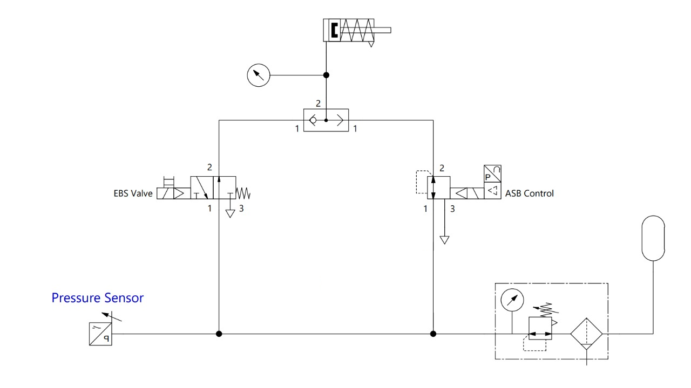

# Pneumatics
We need an emergency braking system that can be activated on loss of electrical power or error from the shutdown loop, and a proportional braking system that can be controlled by the main computer when the robot is running.

## Final Simplified Design
We have validated a simplified design that removes the redundant ASB isolation valve, relying on the intrinsic behavior of the Proportional Valve (VPPM) and the Shuttle Valve (OR logic).

### Detailed Logic & Component Behavior

This design relies on **Fail-Safe Pneumatic Logic**:
*   **0 bar (Vented) = BRAKES APPLIED** (Spring extends cylinder).
*   **>4 bar (Pressurized) = BRAKES RELEASED** (Cylinder retracts).

#### 1. Proportional Valve (ASB) - [Festo VPPM](https://www.festo.com/net/SupportPortal/Files/43063/VPPM_en.pdf)
The VPPM is a 3-way proportional pressure regulator. Its internal behavior ensures safety without an external shut-off valve.

*   **Powered (Normal):** Regulates Output (Port 2) based on setpoint.
*   **Unpowered (0V/0mA):**
    *   **Port 1 (Supply):** **CLOSED**. The valve mechanically blocks the air supply. It does **not** drain the tank.
    *   **Port 2 (Output):** **EXHAUSTING**. The valve mechanically connects Port 2 to Port 3 (Exhaust).
    *   **Proof:** See datasheet functional diagram (3-way regulator). The reset position (spring) closes supply and opens exhaust to 0 bar.

#### 2. EBS Valve - Solenoid
Must be a **Normally Closed (NC)** 3/2-way valve (or wired to act as one).

*   **Powered (Driving):** Opens Supply (1) -> Output (2). Brakes release.
*   **Unpowered (Emergency):** Spring return closes Supply (1) and **Vents Output (2) -> Exhaust (3)**. Brakes apply.

#### 3. Shuttle Valve (OR)
Isolates the two lines. It automatically selects the higher pressure source.
*   **Function:** Prevents the unpowered (venting) VPPM from draining the EBS line during normal driving, and vice-versa.

### System States

| State | EBS Valve (Signal) | VPPM (Signal) | Resulting Pressure | Brake Status |
| :--- | :--- | :--- | :--- | :--- |
| **EMERGENCY (Fail-Safe)** | **OFF (0V)** Vents to Atm | **OFF (0V)** Vents to Atm | **0 bar** | **LOCKED** (Spring Extended) |
| **Driving (Full Release)** | **ON (24V)** Supplies 10 bar | **Controlled** (e.g. 5V / 5 bar) | **10 bar** (from EBS Valve) | **RELEASED** (Cylinder Retracted) |
| **Autonomous Braking** | **OFF (0V)** Vents to Atm | **Controlled** (e.g. 8 bar) | **8 bar** (from VPPM) | **MODULATED** (Partial Release) |

> **Note on "Autonomous Braking" State:** To control the brakes autonomously, we must cut power to the EBS Valve (letting it vent) so the Shuttle Valve takes pressure from the VPPM instead. If the EBS valve stays open (10 bar), the Shuttle Valve will ignore the VPPM (lower pressure) and keep brakes fully released.

### Components
- [Solenoid valve](https://www.festo.com/tw/en/a/575488/) (Emergency)
    - **Type:** 3/2-way, Normally Closed (NC).
    - **Datasheet:** [VUVS Series](https://www.festo.com/net/SupportPortal/Files/477027/VUVS_en.pdf)
- [Proportional Valve](https://www.festo.com/es/es/a/8153644/) (ASB Control)
    - **Model:** VPPM-8L-L-1...
    - **Datasheet:** [VPPM Manual](https://www.festo.com/net/SupportPortal/Files/43063/VPPM_en.pdf)
- [Shuttle Valve](https://www.festo.com/es/es/a/6682/) (OR Logic)
    - **Function:** Logic element OR.
- Pressure sensor

---

## Historical Archive
The [Original "Conservative" Design](diego-design.md) (Diego's Design) included an additional solenoid valve for ASB isolation. This was deemed redundant after verifying the VPPM's power-loss behavior.
