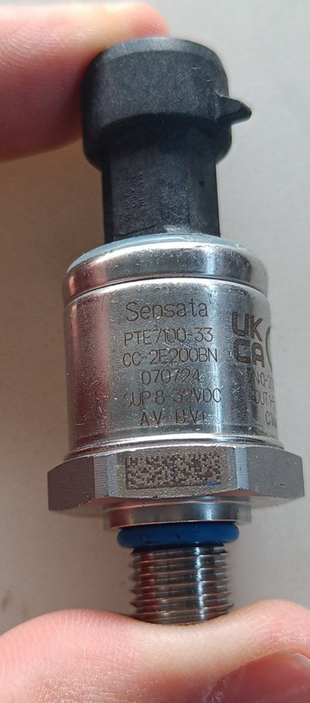

# Hydraulics

The kart keeps its original hydraulic brakes. They are what actually stops the wheels — the
[pneumatic system](../pneumatic-braking/index.md) is the actuator that squeezes them, both for
normal autonomous braking (ASB) and for the emergency circuit (EBS). This page covers the fluid
side: hoses, bleeding, and the pressure sensor that tells the kart how hard it is braking.

## Brake lines

Flexible brake hoses with `M10x1.0 female inverted flare` connectors.

### Bleeding / purging

The lines have to be purged of air after any work that opens the circuit; trapped air makes the
pedal spongy and the pressure reading meaningless. Reference video for the procedure:
[youtu.be/dXhEvykyabk](https://youtu.be/dXhEvykyabk?si=LNnOBOaIlJ93uHi6).

## Brake pressure sensor

A **Sensata PTE7100**, part code `PTE7100-33CC-2E200BN`
([datasheet](../../assets/datasheets/sensata_pte7100_hermetic_analog_pressure_sensor_da-1919220.pdf)).

| | |
|---|---|
| Range | 0–200 bar |
| Output | 1–5 V, supply 8–32 Vdc |
| Pressure port | 7/16-20 UNF-2A (male) |
| Seal | HNBR o-ring |
| Electrical connector | Packard Metri-Pack 150 |
| Supplied with | Neither a mating connector nor a snubber — order both separately |

**Adapter to the brake line:** a `male M10x1.0 inverted flare to female 7/16-20 UNF` adapter, since
the sensor's port thread does not match the hoses.

The sensor's signal lands on one of the Kart Medulla's two hydraulic-pressure ADC inputs — see
[Kart Medulla](../electronics/kart-medulla/index.md). Its 1–5 V swing is divided down on the board
before it reaches the ESP32's 3.3 V ADC.

!!! note "The Mouser listing is for a different variant"
    The [Mouser page we ordered from](https://www.mouser.es/ProductDetail/Sensata-Technologies/PTE7100-32DC-0B200BN?qs=sGAEpiMZZMv1xWCHBjbGeVR9W0yhknQ8lfjrm5f%2FKxVuiB%2F1oy1aA%3D%3D)
    is `PTE7100-32DC-0B200BN`, not the `-33CC-2E200BN` recorded above. The two codes differ in
    port, connector and output options, so check which one is physically on the kart before
    trusting either line.

### Possible alternative

[Bosch Motorsport PSS-260](https://xtramotorsport.com/product/bosch-motorsport-pss-260-brake-pressure-sensor/)
(PN 0261545188) — 0.5–4.5 V, 0–260 bar. Not bought; kept as a fallback if the Sensata becomes hard
to source.
