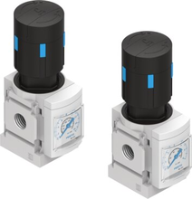
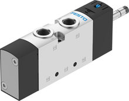
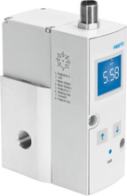
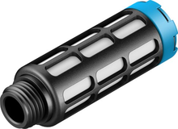

# Pneumatic Braking

The kart needs two braking functions on one pneumatic actuator:

- **ASB (Autonomous Service Brake)** — proportional braking the main computer modulates while the kart is driving itself. Handled by the **VPPM** proportional valve.
- **EBS (Emergency Brake System)** — full braking that must engage automatically whenever the shutdown circuit opens or power is lost. Handled by the **EBS** solenoid valve.

The actuator is **air-to-apply**: pressure extends the cylinder onto the brake, and venting lets the return spring release it. The low-pressure reservoir stores enough air to keep braking after a shutdown.

## Validated design

This is the circuit we **built and physically validated (May 2026)**. It uses an **OR / shuttle valve** to merge the two branches, and it has **no isolation valve in series with the proportional valve** — testing confirmed none is needed (see the two sections below).

<object data="images/ebs-validated.svg" type="image/svg+xml" style="width:100%;max-width:920px;"></object>

> **Tip:** Click any component in the diagram to open its Festo product page. Yellow dots are CK compression fittings; blue lines are tubing; grey dashed lines are exhaust.

> **Source side under revision (2026-07).** The May 2026 validation used a VEVOR 6 L compressor+tank (max ~8.3 bar). The current plan drops that combo for a **salvaged portable inflator (motor + piston only, no original electronics)** charging a **Festo CRVZS-0,75** 0.75 L reservoir to **10 bar**. The downstream valve circuit below is unchanged, but the source swap is **not yet re-validated**. Two open items: the salvaged compressor needs its own over-pressure cutoff (current + temperature) since it lost the original electronics, and removing the low-pressure regulator is under consideration (redundant once the tank is capped at ≤10 bar — see the pressure note below and the safety-relief-valve task in `dv/tasks.md`).

The compressor keeps the tank topped up. Air passes the manual isolation valve and the regulator (capped at 10 bar), then splits at the NPFC-T into two parallel branches that recombine at the OR valve before reaching the actuator:

| Situation | EBS solenoid (normally-open) | VPPM proportional | Result at actuator |
|---|---|---|---|
| **Autonomous driving** (powered) | energised → supply blocked, its branch vents to atmosphere | regulates 0–10 bar on command | OR valve passes the **VPPM** pressure; the computer modulates braking |
| **Emergency / power loss** | de-energised → full tank pressure to its output | unpowered → all ports blocked | OR valve passes the **full EBS** pressure; the kart brakes hard |

The hardware is sponsored by **Festo** (see the [BOM](bom.md) for the donated parts).

## Why no isolation valve in series with the proportional valve

The obvious worry: when the EBS dumps full pressure into the actuator line during an emergency, could that air leak *out* through the proportional valve — backwards to the supply, or forwards to atmosphere through the VPPM's exhaust — and bleed away the braking force? An extra "ASB" solenoid in series ahead of the VPPM would block that path. We tested without it and it holds, for two independent reasons:

1. **The VPPM blocks itself when unpowered.** It is a 3/2-way *normally-closed* proportional regulator. On power loss the spring returns it to rest and **all three ports are isolated** — no supply path, no exhaust path. Festo's datasheet wording is "output pressure is maintained" (not vented). So pressure sitting at the VPPM's output cannot escape through it. (Full datasheet evidence below.)
2. **The OR valve already isolates the VPPM branch during an emergency.** The shuttle's ball is pushed by the higher-pressure side, sealing the lower-pressure side. When the EBS supplies full pressure, the ball seals off the VPPM branch, so emergency air never even reaches the VPPM.

Either mechanism alone would be enough; together they make a series isolation valve redundant. The physical test confirmed the actuator holds full pressure with no measurable loss through the VPPM, so the extra valve (its weight, cost, coil, and one more leak path) was removed.

## Why the OR / shuttle valve *is* required

The OR valve is **not** optional. During autonomous driving the EBS solenoid is energised, which connects its output to its exhaust — that branch is **open to atmosphere**. If the two branches were simply teed together, the pressure the VPPM is trying to regulate would pour straight out of the EBS's open exhaust and the brake would never build force.

The shuttle valve solves this: its ball always seals the lower-pressure (venting) inlet and passes the higher-pressure one to the actuator.

- **Driving:** VPPM side is pressurised, EBS side is venting → ball seals the EBS side → regulated pressure reaches the actuator.
- **Emergency:** EBS side is at full pressure, VPPM side is blocked → ball seals the VPPM side → full pressure reaches the actuator.

So the OR valve keeps the active branch from losing its air through the inactive branch's exhaust, in **both** directions of operation. That is the single reason it has to be there.

## VPPM unpowered behavior: the datasheet evidence

The VPPM analysis above hinges on one fact — that the valve blocks all ports when unpowered. Festo's datasheet calls this state "unregulated", which is ambiguous, so here is the evidence it actually means *all ports blocked, pressure trapped*.

**Sources:**

- Festo VPPM catalog documentation 205274 ([local](../../assets/datasheets/205274_documentation.pdf) | [online](https://www.festo.com/media/catalog/205274_documentation.pdf))
- Festo VPPM-8L-L-1-G14-0L10H-V1P-S1C1 datasheet, part 571293 ([local](../../assets/datasheets/VPPM_en.pdf) | [online](https://www.festo.com/us/en/a/571293/))

| Evidence | Location | Implication |
|---|---|---|
| Valve function: **"3-way proportional-pressure regulator, closed"** | 205274, page 2, "Valve function" table | The valve's default state is "closed" |
| Type code position 006: **"1 = 3/2-way valve, normally closed"** | 205274, page 4, type code table | Confirms the de-energized state is "closed" |
| **"Pressure is maintained if the controller fails"** | 205274, page 2, "Operationally safe" section | Output pressure does NOT vent to exhaust |
| **"Safety position VPPM: if the power supply cable is interrupted, output pressure is maintained unregulated."** | 571293 datasheet, page 1, "Safety instructions" row | No active regulation, but pressure is _maintained_ |
| Design: **"Piloted diaphragm regulator"** | Both datasheets | Piloted = a small solenoid controls a larger diaphragm |
| Type of reset: **"Mechanical spring"** | Both datasheets | Spring returns the diaphragm to its rest (closed) position |

**Interpretation.** The VPPM is a piloted diaphragm regulator with a mechanical spring return. When powered, its controller modulates the pilot to open/close the supply (1→2) and exhaust (2→3) paths. When power is lost: the pilot de-energizes, the spring returns the diaphragm to rest, and **all three ports are isolated**. "Maintained" is the key word:

- If port 2→3 (exhaust) were open, pressure would vent — it would *not* be maintained.
- If port 1→2 (supply) were open, pressure would *rise* to supply pressure, not just be maintained.
- "Maintained" means the pressure stays put, decaying only through slow natural seal leakage.

This is exactly the condition that lets us skip the series isolation valve.

## Component references

The diagram uses plain-English labels. Where possible we link to **local PDFs** in this repo; vendor links may require login or be blocked.

Terminology:

- `SDE5` is the Festo product family for our pressure sensors. The diagram calls them "Pressure sensor (tank side)" and "Pressure sensor (regulated side)".
- `NPFC-T` is a threaded T-adapter with 3× G1/4 female ports. Each port takes a CK-1/4 compression fitting.

| Component | Photo | Max pressure | BOM section | Local docs | Vendor link |
|---|---|---|---|---|---|
| Reservoir — Festo CRVZS-0,75 (160235) |  | **16 bar** rated (charged to 10) | [`Compressor & Tank`](bom.md#compressor-tank) | [`160235`](https://ftp.festo.com/Public/PNEUMATIC/SOFTWARE_SERVICE/DataSheet/EN_GB/160235.pdf) | [Festo](https://www.festo.com/us/en/a/160235/) |
| Compressor — salvaged portable inflator (motor + piston only) |  | ~10 bar target (being characterised) | [`Compressor & Tank`](bom.md#compressor-tank) |  | — |
| Pressure sensor (tank side) |  | **10 bar** (measurement range) | [`Pressure Sensor 1`](bom.md#pressure-sensor-1-tank-side-before-regulator) | [`567465datasheet.pdf`](../../assets/datasheets/567465datasheet.pdf) | [Festo](https://www.festo.com/es/es/a/567465/) |
| Manual valve (release/isolation) |  | — | [`Manual Valve`](bom.md#manual-valve-brake-release-isolation) |  |  |
| Pressure regulator (D7) |  | 0.5-12 bar output | [`Low-Pressure Regulator`](bom.md#low-pressure-regulator) | [`527690datasheet.pdf`](../../assets/datasheets/527690datasheet.pdf) | [Festo](https://www.festo.com/es/es/a/527690/) |
| Pressure sensor (regulated side) |  | **10 bar** (measurement range) | [`Pressure Sensor 2`](bom.md#pressure-sensor-2-regulated-side-before-valves) | [`567465datasheet.pdf`](../../assets/datasheets/567465datasheet.pdf) | [Festo](https://www.festo.com/es/es/a/567465/) |
| NPFC-T threaded T-adapter |  | — | [`Compression Fittings`](bom.md#compression-fittings) |  | [Festo](https://www.festo.com/es/es/a/8030236/) |
| EBS solenoid valve (VUVS) |  | **10 bar** operating | [`EBS Electrovalve`](bom.md#ebs-electrovalve-emergency-braking) | [`575488datasheet.pdf`](../../assets/datasheets/575488datasheet.pdf) | [Festo](https://www.festo.com/es/es/a/8035174/) |
| OR / shuttle valve |  | — | [`Shuttle Valve`](bom.md#shuttle-valve-or-valve) |  | [Festo](https://www.festo.com/es/es/a/6682/) |
| ASB proportional valve (VPPM) |  | **11 bar** inlet | [`VPPM Proportional Valve`](bom.md#vppm-proportional-valve-asb) | [`205274_documentation.pdf`](../../assets/datasheets/205274_documentation.pdf), [`VPPM_en.pdf`](../../assets/datasheets/VPPM_en.pdf) | [Festo](https://www.festo.com/es/es/a/571293/) |
| Brake actuator (ADN) |  | **10 bar** (50mm bore) | [`Pneumatic Actuator`](bom.md#pneumatic-actuator) | [`adn-s-enus.pdf`](../../assets/datasheets/adn-s-enus.pdf) | [Festo](https://www.festo.com/gb/en/a/8084714/) |
| Exhaust silencers (G1/4 + G1/8) |  | — | [`Silencers`](bom.md#silencers) | [`2316datasheet.pdf`](../../assets/datasheets/2316datasheet.pdf) | [Festo G1/4](https://www.festo.com/es/es/a/2316/), [Festo G1/8](https://www.festo.com/es/es/a/2307/) |
| Tubing + fittings |  | 10 bar (tubing) | [`Tubing`](bom.md#tubing), [`Compression Fittings`](bom.md#compression-fittings) | [`197384datasheet.pdf`](../../assets/datasheets/197384datasheet.pdf), [`2029datasheet.pdf`](../../assets/datasheets/2029datasheet.pdf), [`4469datasheet.pdf`](../../assets/datasheets/4469datasheet.pdf) | Tubing: [Festo](https://www.festo.com/es/es/a/197384/), CK: [Festo](https://www.festo.com/es/es/a/2029/), NPFC-T: [Festo](https://www.festo.com/es/es/a/8030236/), LCK: [Festo](https://www.festo.com/es/es/a/4469/) |

> **Max system pressure: 10 bar.** The weakest downstream components (VUVS valve, SDE5 sensors, ADN-S actuator) are rated to 10 bar. The VPPM inlet accepts up to 11 bar. The D7 regulator can output up to 12 bar — **never set it above 10 bar** or downstream components may be damaged. The D6 variant only reaches 7 bar (too low); there is no MS4-LR variant capping at exactly 10 bar, so the D7 is necessary but requires care when adjusting.

### [Bill of Materials](bom.md)

---

## Historical archive

Two earlier candidate circuits — a super-simplified version (no OR valve, no ASB valve) and a full/conservative version (ASB valve **and** OR valve) — are kept with their diagrams on the [**Design History page**](design-history.md), along with why each was dropped in favour of the validated design (OR valve, no series ASB).
