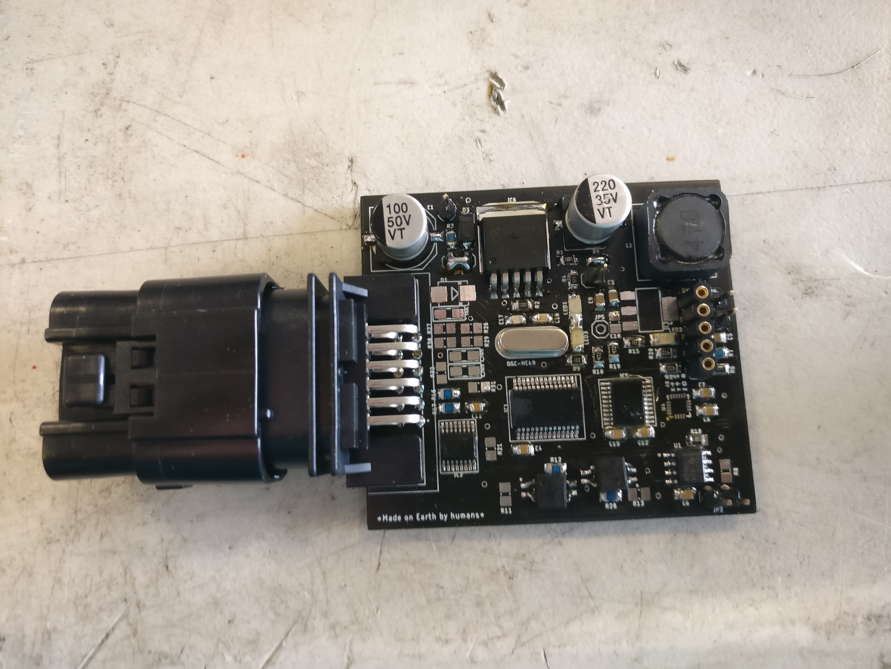

# Wheel Sensorization Module — Legacy (SENv_03)

!!! warning "Legacy module — 2020–2022"
    This wheel-hub sensorization PCB (SENv_03) is **not part of the current kart**. It was designed and built between 2020 and 2022 and has been superseded by the current wheel-speed signal path through the Kart Medulla. Kept here as a reference for any future redesign — PCB layout, sensor-fusion approach, and project artifacts may be useful starting points.

## What it was

A custom PCB module that mounted in the wheel hub to provide wheel speed sensing, odometry, and vehicle state data for the autonomous control loop.

## Design summary

- **Custom PCB** (SENv_03) — purpose-built for wheel-hub mounting, schematic-to-assembly done in-house (KiCAD/Altium).
- **Odometry + positioning** — high-frequency sensor readings feeding the vehicle state estimator.
- **Compact integration** — fit within the wheel hub envelope.
- **Communication** — CAN bus interface to the vehicle network.

## Project artifacts

Original design review documents (PowerPoint / Word):

- [Design Release Presentation](../../assets/files/wheel-sensor-design-release.pptx) — full design review and technical specifications.
- [Technical Documentation](../../assets/files/wheel-sensor-documentation.docx) — implementation detail.
- [Project Approval Presentation](../../assets/files/wheel-sensor-project-approval.pptx) — original project proposal and system overview.

## Why it's documented here

Future iterations of wheel-side instrumentation (e.g. a wheel-hub temperature sensor, a strain-gauge ride-height pickup, or a redesigned speed encoder) can reuse:

- The wheel-hub mechanical envelope work.
- The CAN-side signal conditioning approach.
- The schematic-to-manufacturing process the team has already validated.
