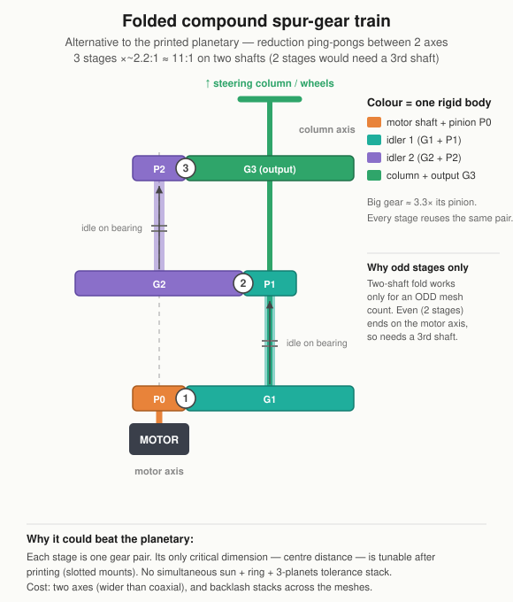

# Folded Compound Gear Train (alternative)

!!! warning "Status: in progress"
    A live alternative, not built. The most **print-forgiving** option — worth prototyping if the planetary's tolerance sensitivity keeps biting. **TODO:** prototype + measure backlash.

## Idea

A spur reduction folded back onto **two axes** (motor + column) so it doesn't sprawl sideways. Each stage is a single gear pair; compound idlers (a big gear and a small gear fixed together) ride on bearings and ping-pong the reduction between the two axes. Motor at the bottom, steering column out the top.

## Why it could beat the planetary

Each stage is **one gear pair**, and a pair only has to get **one** thing right — centre distance — which you can tune *after* printing by sliding the bearing mounts. There is no simultaneous-mesh tolerance stack (the planetary breaks because three planets must mesh the sun *and* ring at once, unadjustable post-print). Same printed flaws, far less consequence.

## Ratio & the odd-stage rule

Each mesh hops between the two axes, so the output lands back on the column only with an **odd** mesh count:

- **3 stages × ~2.2:1 ≈ 11:1 on two shafts** (the diagram).
- A 2-stage × ~3.3:1 version is fewer meshes/gears/backlash, but an even mesh count lands back on the motor axis → it needs a **third countershaft**.

So the trade is **shaft count vs mesh count**, not a free win.

## Costs

- Two parallel axes → wider than the coaxial planetary.
- **Backlash stacks** across the meshes (the column encoder handles position, but stiffness/feel takes the hit).
- **Lowest torque capacity** of the live options — a single tooth-pair contact per mesh, no load sharing (see the [torque ranking](index.md#torque-capacity-ranking)).

## CAD

!!! todo "Diagram only"
    The schematic above is the concept. If prototyped: model in Fusion (two-axis layout, compound idlers on 608 bearings, slotted mounts for centre-distance tuning), add a public-link embed + STEP.
