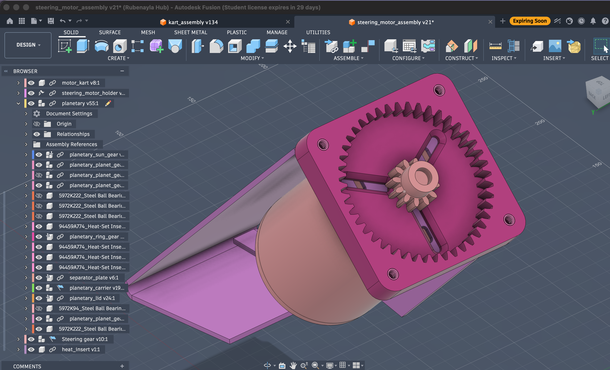
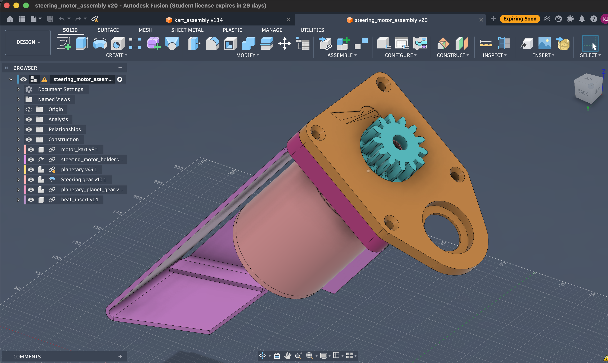

# Steering System

For the kart to drive itself, something has to turn the wheels. The steering system is the drive-by-wire actuator that does it: a motor turns the steering column to whatever angle the autonomy stack asks for, in a closed loop against an angle sensor.

## Key dimensions

| Dimension | Value |
|---|---|
| Steering column diameter | 20 mm |
| Motor shaft / sun-gear bore | 10 mm |
| Planetary centre distance | 28 mm |
| Output gear-pair centre distance | 66 mm |

The **Fusion 360 model is the single source of truth** for all geometry. This table is a convenience copy for quick reference — if it ever disagrees with the CAD, the CAD wins. An early hand-measured photo of the mechanism is on the [previous designs](previous-designs.md) page.

## Actuator architecture — how we drive the column

The current design is a **rotary actuator on the steering column**: a salvaged DC motor geared down through a ~11:1 reducer turns the column directly, with an AS5600 magnetic encoder closing the loop. This is the second architecture the team built — the first was a Maxon linear actuator on the steering linkage, since dropped (see [previous designs](previous-designs.md)).



*The current steering actuator (Fusion `steering_motor_assembly v21`): the DC motor (left) drives the planetary reducer mounted on the bracket; the carrier output goes on to the column gear.*

Why the current approach won:

- **Column-coaxial rotary, not linear.** Turning the column directly is mechanically simpler than pushing the linkage with a ball-screw, and it keeps the actuator compact and in line with the shaft.
- **Salvaged motor + printed reducer, not an off-the-shelf servo.** The motor was free (out of a discarded massage chair) and the reducer is a few euros of filament plus bearings. The whole actuator can be rebuilt or reprinted when it breaks — which, being printed gears, it does. Off-the-shelf gearmotors we considered (and didn't adopt) are on the [motor options](motor-options.md) page.
- **Plain PWM control, not a vendor ecosystem.** An H-bridge taking 3.3 V PWM from a microcontroller is something we can debug ourselves — the opposite of the EPOS/CANopen black box the Maxon path forced on us.
- **Backdrivable.** If the electronics die the wheels still turn by hand, because the planetary reducer backdrives.

The cost is durability: printed gears wear and the motor-shaft interface creeps. That trade — cheap and repairable over robust and expensive — is the through-line of the whole steering design.

## Signal chain

```
Orin (target angle)  ──USB──▶  ESP32-S3 / Kart Medulla
                                   │  PID
                                   ▼
              AS5600 ──angle──▶  PWM 3.3 V
              (column)              │
                                    ▼
                              MD25HV H-bridge ──▶ DC motor ──▶ ~11:1 reducer ──▶ column
```

## Main process

We need to move the steering shaft to the target angle.

1. The microcontroller reads the target position from the main computer (Orin) and the current position from the **AS5600 magnetic encoder** on the column.
    - The microcontroller is the ESP32-S3 on the [Kart Medulla](../electronics/kart-medulla/index.md) board (earlier prototypes used a Blue Pill / Teensy 4.0).
2. It computes a PWM duty cycle with a PID loop and sends 3.3 V PWM to the H-bridge.
3. The H-bridge (MD25HV) receives the PWM and powers the DC motor.
    - The MD25HV accepts control voltages from 1.8 V–30 V, so 3.3 V PWM from the ESP32 works directly.
    - [Datasheet](https://docs.google.com/document/d/1xJHVG2dc3aEtedCHf3L9NzUy5KqpxeWjeS9Lfh9XuqA)

See [H-bridge](h-bridge.md) and [Angle sensor](sensor/index.md) for the electronics, and [Reducer](reducer.md) for the gear train.

## Motor data


24 V geared DC motor (salvaged), driven from the battery through the Cytron MD25HV H-bridge with PWM. At stall it pulls 47 V × 43 A ≈ 2 kW; normal steering work is only ~47 W (see sizing below).



*Motor on its bracket (Fusion `steering_motor_assembly v20`): the carrier/sun mounts straight onto the motor shaft, so the reducer is coaxial with the motor.*

## Sizing the actuator

What the steering needs, all measured at the steering column (after the ~11:1 reduction). Figures from experience with the built actuator.

**Torque.** Turning the stopped wheels takes ~4 Nm to break the tyres loose; we size for **~8 Nm** with margin — the figure specified to Maxon in the 2025-01-07 YEP application.

**Speed.** The wheels swing ~±25° (≈50° lock-to-lock). The current motor sweeps that side to side in ~0.15 s on the ground, faster with the wheels lifted — about 6 rad/s (~56 rpm).

**Power** = torque × speed = 8 Nm × 6 rad/s ≈ **47 W**.

Power is never the constraint here. The 13S pack (~48 V) through the Cytron driver supplies far more than 47 W; at stall the motor pulls 47 V × 43 A ≈ 2 kW, nearly all of it heat. What the ~11:1 reduction buys is torque — it trades the motor's cheap speed for the ~8 Nm the column needs, so the motor isn't sitting near stall (and overheating) just to hold an angle.

### Design constraints

- **Available voltages**:
    - Battery: 13S (41.6 V – 54.6 V)
    - Regulated: 12 V, 5 V, 3.3 V
- **Budget**: < 1000 € for new components
- **Note**: integrated servos were considered as an alternative to separate electronics — see [motor options](motor-options.md).

## Reducer & alternative designs

The motor's speed is geared down to torque through a **~11:1 two-stage reducer** (a 3D-printed planetary + an output gear pair). The design, the gear-material saga, and the failure modes are on the **[Reducer](reducer.md)** page.

The other reducer types we weighed — cycloidal, folded compound gear train, worm, harmonic, belt — and the two we're keeping as live alternatives to print and test, are on **[Alternative reducer designs](alternatives/index.md)**.

## CAD

!!! info "CAD available on request"
    The steering assembly is modelled in Fusion 360. We haven't published the files here yet — if you'd like the CAD for your own build, [get in touch](../../contact.md). Reducer details are on the [Reducer](reducer.md) page.

## History

Earlier directions that were built and dropped — the Maxon EPOS linear actuator, the first 3-planet reducer, the gear-material progression — are on **[Previous designs](previous-designs.md)**.
