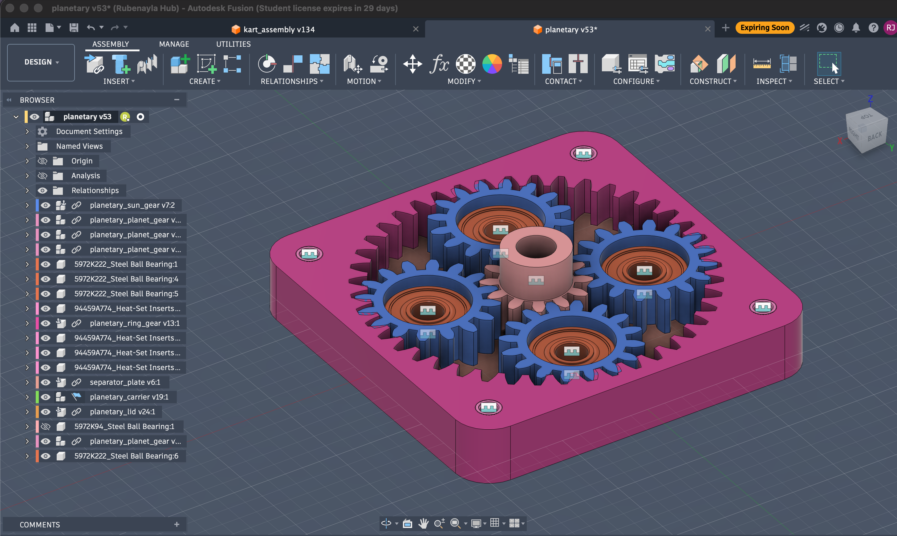
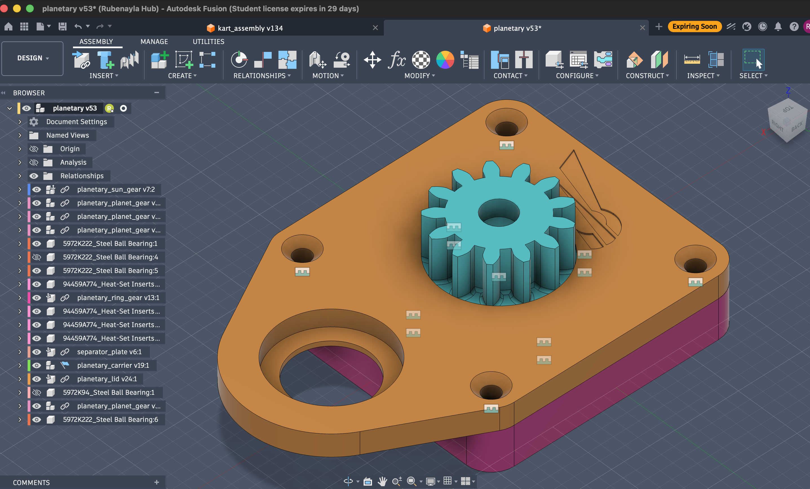

# Steering Reducer

The salvage motor spins fast and weak; the steering column needs the opposite — slow and strong. The reducer trades the motor's cheap speed for torque. See [Sizing the actuator](index.md#sizing-the-actuator) for why (torque is heat-limited, speed is basically free) and the numbers (~8 Nm at the column, ~47 W, ~11:1 reduction).

## Why a planetary

We needed ~11:1 in a small, **coaxial** package, cheap enough to reprint when it breaks, and **backdrivable** (so the wheels still turn by hand if the electronics die). A planetary packs the whole reduction into one ring of gears around the shaft — coaxial and compact, load shared across the planets, and it stays backdrivable.

The other reducer types either don't backdrive (worm, ball-screw), can't be printed with any strength (harmonic flexspline), or sprawl across two axes (plain gear train). Full comparison and the two alternatives we're keeping live: **[Alternative reducer designs](alternatives/index.md)**.

The price of the planetary is that it's the **least forgiving of print error** — every planet has to mesh the sun *and* the ring simultaneously, so all the tolerances have to agree at once. That's the source of most of the failures below.

## Current design (~11:1, two stages)

| Stage | Type | Teeth | Module | Centre distance | Ratio |
|---|---|---|---|---|---|
| 1 — planetary | sun → 4 planets → fixed ring | sun 12, planet 16, ring 44 | 2 mm | 28 mm | 4.67 : 1 |
| 2 — output pair | pinion → big gear (to column) | pinion 13, gear 31 | 3 mm | 66 mm | 2.38 : 1 |
| **Total** | | | | | **≈ 11.1 : 1** |

All three planetary gears share **module 2 mm, 20° pressure angle**. The geometry isn't free: an internal planetary obeys `Z_ring = Z_sun + 2·Z_planet` (44 = 12 + 2·16), so fixing the ring at 44 and the sun at 12 **forces** the planet to 16 and the centre distance to `m·(Z_sun + Z_planet)/2 = 28 mm`. The ratio is `1 + Z_ring/Z_sun = 4.67` (fixed ring, sun input, carrier output).

The planetary was 5.4:1 with a 10-tooth sun; it dropped to 4.67:1 when the sun/planets moved to the **Norelem hub geometry** (12-tooth sun, off-the-shelf steel option). Full Fusion parameters live in the team's `kart/steering/` files (`planetary_reducer_parameters.md`, `output_pinion_parameters.md`).

*The current planetary (Fusion `planetary v53`): 12-tooth sun at centre, 4 planets, 44-tooth ring.*

The planets ride on the carrier (the output); the sun is the motor input and the ring is held fixed:

*Carrier plate with the sun gear — the carrier clamps to the motor shaft and carries the four planets on steel ball bearings.*

### Gear generation

The gear tooth profiles are generated in Fusion 360 with the **[GF Gear Generator](https://apps.autodesk.com/FUSION/en/Detail/Index?id=1380101096547741187)** plugin, one part file per gear, referencing the shared module / teeth / pressure-angle parameters. Two gotchas worth knowing:

- The generator needs a **Hybrid Design** file type — Part Design refuses to add the gear component.
- The generated teeth are **static geometry**, not parametric — changing a tooth-count parameter does *not* re-cut the teeth. Each gear has to be **regenerated** when its tooth count changes (and the circular-pattern count is hard-set, so bumping the parameter alone leaves stale geometry — a trap that has bitten us). Promote module / teeth / face width to user parameters so downstream features still update.

## Gear materials — the real problem

Choosing a gear material isn't picking "the best" one; it's deciding **what to optimise** — every property trades against another:

> low friction ↔ creep resistance ↔ rigidity ↔ wear ↔ toughness (not brittle) ↔ printability ↔ cost

| Material | Why considered | Why it fell short |
|---|---|---|
| **PLA** | stiff, trivial to print | brittle → poor fatigue; teeth snap, gears split. Broke after 5 laps. Fine only for the big, low-stress gears. |
| **ABS** | tougher than PLA, more heat, easy + cheap | not slippery, still creeps — but with the steel sun taking the D-flat load, it's good enough. **This is the current printed material** for the planets and carrier. |
| **Nylon (PA)** | low friction, tough — the classic gear plastic | **creeps** under sustained load → the D-flat on the motor shaft rounds off and slips. Absorbs moisture. |
| **PPA** | aromatic-ring nylon: stiffer, far less creep, low moisture | the step up; harder + dimensionally stable, better wear under load. |
| **PPA-CF** | carbon adds stiffness | CF is abrasive (wears the steel it grips) and embrittles → can *worsen* the cracking it's meant to fix. Test before committing. |
| **Brass / steel** | the endgame for the part that matters | machined / off-the-shelf (Norelem hub sun); no plastic wins at the motor interface. |

### The root cause: the D-flat, not the gears

The real weak point is the **motor-shaft interface** — a D-flat + set screw in a creeping plastic. Fix the material *there* (brass / Norelem steel sun) and the root failure goes away regardless of what the rest is printed in. This is also why a [cycloidal drive](alternatives/cycloidal.md) wouldn't dodge it — its eccentric input mounts on the same D-flat.

### Failure modes seen

- **PLA** — brittle fracture: snapped teeth, gears split, within minutes of load.
- **Nylon** — D-flat creep (the flat rounds off → slip); teeth round off under sustained load.
- **Holder / carrier deformation** — the mount flexing under load lets the gears separate and skip; a failure path independent of the gears themselves.

!!! note "Status: still iterating"
    Six print generations in, it works — kind of. Current path: a **Norelem steel hub sun** for the D-flat (the real failure point), the planets and carrier printed in **ABS**, and watching the carrier stiffness. PPA / PPA-CF were weighed for the printed gears but not adopted — ABS is tough enough once the steel sun carries the D-flat load. Not solved.

## CAD

!!! info "CAD available on request"
    The reducer is fully modelled in Fusion 360 — the parametric design, a STEP, and print-ready gear STLs. We haven't published the files here yet, but we're happy to share them: if you'd like the CAD for your own build, [get in touch](../../contact.md).
