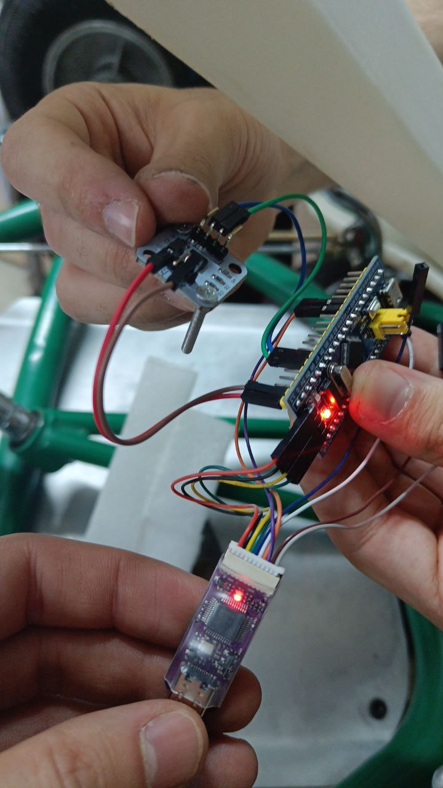
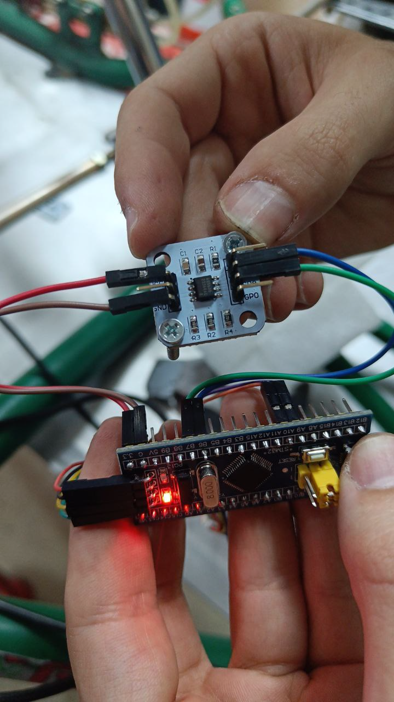

# Steering Angle Sensor

The steering angle sensor measures the column angle for the steering PID loop. It reads a magnet
mounted on the steering shaft and reports the absolute angle to the Kart Medulla ESP32.

## Current sensor: MagnTek MT6701, read as PWM

The **MT6701** is the sensor on the kart. It is a magnetic angle encoder, permanently configured in
its EEPROM to output the angle on a **single wire as a PWM signal** — the angle is encoded in the
duty cycle, not sent over a bus.

| Property | Value |
|---|---|
| Output | Single-wire PWM, ~994.4 Hz frame rate, high-valid |
| Resolution | 12 bits over a frame of 4119 clock periods — one count is 0.088°, a 244 ns slice of edge timing |
| Read by | ESP32-S3 MCPWM capture on **GPIO 1** (terminal CN5.2), both edges timestamped in hardware |
| I²C address | 0x06, if ever needed — but the kart's angle does **not** come over I²C |
| Recommended magnet | Ø6 × 2.5 mm diametric, air gap 0.5–2.0 mm, off-axis ≤ 0.3 mm |

**It is validated on the kart, not just wired up.** The firmware counts accepted and rejected PWM
frames and reports both in its health telemetry. On the kart that counter climbs at **993 frames
per second with zero rejects**, against the sensor's nominal 994.4 Hz. That is the measurement that
separates "reading the sensor" from "reading something": a capture triggering on electrical noise
would show rejects climbing, and a dead line would show the count flat. Neither happens.

The reading is never smoothed or held: the firmware returns the newest decoded frame, and returns
an explicit *invalid* rather than a number whenever no fresh frame has arrived. The PID stops the
steering motor instead of acting on an unknown angle.

!!! note "Off-axis mounting degrades, it does not fail"
    Past the 0.3 mm off-axis figure the MT6701 does not drop out — the error grows smoothly as a
    once-per-revolution distortion, and the angle stays continuous and repeatable. That number is
    where the datasheet *guarantees* rated accuracy, not a cliff. For kart steering, where a few
    degrees is acceptable, mounting tolerance is not a hard constraint. This is a different failure
    class from the AS5600's problem below, which was a *detection* failure.

## Why this sensor, and not the AS5600

Two reasons, in the order they mattered.

**The magnet.** This is the one that settled it. The AS5600 works by sensing how the *axial* field
varies across a 1 mm circle on the die — it reconstructs the angle from the shape of that variation.
The kart's shaft "magnet" is two large magnets stuck on sideways, and a big magnet produces a field
that is strong but almost **uniform** over a 1 mm span. There is no variation for the AS5600 to
measure, so it reports *no magnet detected* and gates its own output, even with the chip touching
the magnet. The MT6701 instead senses the **direction** of the in-plane field at a single point,
which a large magnet defines strongly and cleanly. That difference in sensing principle — not
resolution, not price — is the reason for the change.

**The cable run.** The Kart Medulla sits at the rear, next to the Orin, because the two connect over
USB. That puts it roughly **1.2 m** from the steering shaft. I²C does not survive that distance
reliably: it is noise-sensitive, and a single glitch can hang the medulla's shared I²C bus, taking
down more than the steering read. One PWM wire is robust over the run and never touches that bus.

!!! warning "A bigger magnet is not a licence for sloppy mounting"
    It would be easy to read the above as "the MT6701 tolerates anything". It does not. Its
    datasheet asks for essentially the *same* small diametric magnet, tight air gap and centring as
    the AS5600. What it tolerates is our specific problem — a strong, spatially uniform field — not
    arbitrary mounting error.

## Electrical connection

The wiring and firmware detail for the sensor input — the CN5.2 terminal, GPIO 1 on the ESP32-S3,
removing the R10 pulldown, and MCPWM pulse capture — is **not duplicated here**. See:

- [Wiring](../../electronics/wiring.md) — the electrical connection (which terminal, which GPIO, resistor changes).
- [Kart Medulla](../../electronics/kart-medulla/index.md) — the board and pinout.
- [Firmware](../../electronics/kart-medulla/firmware.md) — how the angle feeds the steering PID.

## Operating point (steering actuator context)

The sensor closes a loop around a column-driven steering actuator (there is **no rack** on the
kart). Ballpark operating point, for context:

| Quantity | Value |
|---|---|
| Column torque target | ~8 Nm (sized with margin; ~4 Nm minimum to break the tyres loose stopped) |
| Total reduction | ~**11:1** (4.67:1 planetary × 2.38:1 pinion) |
| Steering range | ~±25° at the column (≈50° lock-to-lock) |
| Nominal power | ~**47 W** (8 Nm × ~6 rad/s during a ~0.15 s lock-to-lock) |
| Stall (worst case) | ~**2 kW** (≈47 V × 43 A into the windings — reserve, almost all heat, not an operating point) |

Source: `dv/kart/steering/README.md` (kart canonical operating point). The dv README points at a
`power-budget.md` that does not exist; these numbers are consolidated here for reference.

## History

Everything below describes hardware that is **no longer on the kart**. It is kept so the reasoning
can be re-checked, not followed.

??? info "The AS5600 — the previous sensor, retired 2026-07-12"
    An **AS5600** magnetic encoder read over **I²C**, mounted at the front of the kart near the
    steering shaft to keep the I²C run short. It was in use through the 2025 bench work and into
    2026.

    It was retired after bench testing showed it could not read the kart's shaft magnet at all — see
    "Why this sensor, and not the AS5600" above for the mechanism. On the bench with the chip
    touching the magnet, its magnitude reading peaked erratically and its magnet-detect flag stayed
    mostly at zero; with that flag clear, the chip deliberately gates its output regardless of
    output mode. It was not a wiring fault and no firmware change could have recovered it.

    

    **Hand-wired bench setup (June 2025):** AS5600 breakout, an STM32 "Blue Pill", and a USB-serial
    adapter, before any of it moved onto the medulla PCB.

    
    

    Basic Blue Pill reading code from that era, kept for reference:
    <https://github.com/rubenayla/bluepill-angle-arduino.git>

??? info "AS5600 wiring colours (obsolete — hand-wired harness only)"
    This colour code belonged to the hand-wired AS5600 setup and was never official. It does not
    describe anything currently on the kart.

    | Colour | Signal |
    |-------|--------|
    | Grey / Black | GND |
    | White | 3.3 V |
    | Green | SDA |
    | Blue | SCL |

    The 2026-03 wiring note listed GND as **black**; the earlier 2025 harness used grey. Both
    existed, which is why this was never trustworthy without checking the actual wire.

??? info "Options considered and not used"
    - **AS5600 in PWM mode.** Attempted so that the front-mounted AS5600 could send a single wire
      to the rear and dodge the cable-length problem, before the magnet issue settled the matter.
      It never produced a usable signal on the bench: the output pin read as floating, which
      traced to an open connection somewhere in the path from the chip's OUT pad through the
      terminal and its series resistors to the ESP32 — not to a proven dead chip. It also needs a
      one-time, irreversible OTP burn to enable, which made it a poor thing to gamble on.
    - **MPS MagAlpha MA732.** The sensor-research pick, and in the same in-plane direction-sensing
      class as the MT6701, with better off-axis tolerance. Not bought: it is a bare QFN chip
      needing a breakout, pricier and slower to source, and the ~€10 MT6701 module solves the same
      magnet problem and was already in hand. Worth revisiting only if the MT6701's mounting ever
      fights the kart's sideways-magnet geometry.

    Detailed comparison of the two sensing principles, with the datasheet citations behind them, is
    in `kart-medulla/history.md` (2026-07-11 and 2026-07-12).
