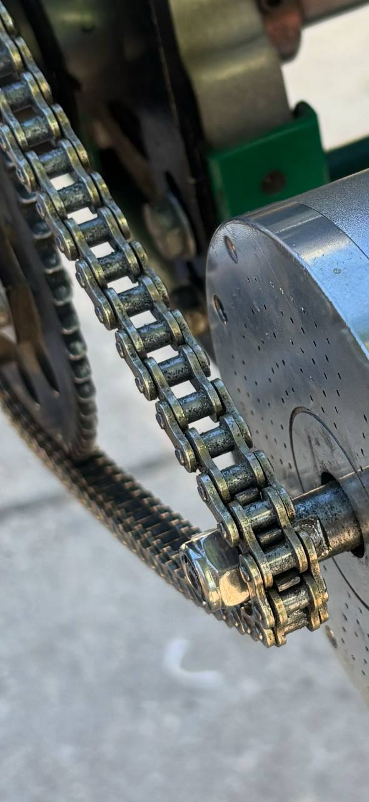

# Transmission System

## Current Configuration - 219 Kit

The kart currently uses a **standard 219 pitch karting transmission system**. This is the definitive configuration after testing and discarding the original T8F kit that came with the motor.

### Components

#### Chain

- **Type:** IRIS 219 pitch chain
- **Color:** Gold
- **Length:** 100 links
- **Status:** Installed and working
- **Purchase link:** <a href="https://kpsracing.es/cadenas-y-cubrecadenas/2434-649-cadena-iris-219.html#/254-numero_pasos_cadena-100" target="_blank">IRIS 219 Chain at KPS Racing</a>

#### Rear Sprocket (Corona)
- **Type:** Aluminum 219 pitch sprocket
- **Color:** Black anodized
- **Teeth:** *(Check sprocket for exact number)*
- **Status:** **Damaged - needs replacement** (~20€)
- **Damage cause:** Used incorrectly with T8F chain (incompatible pitch)
- **Replacement link:** <a href="https://kpsracing.es/coronas/5957-9775-corona-aluminio-219-negra.html" target="_blank">219 Aluminum Sprocket at KPS Racing</a>

#### Front Sprocket (Piñón)
- **Type:** Custom 219 pitch sprocket
- **Manufacturing:** Laser cut (custom design)
- **Material:** Steel
- **Teeth:** Multiple options manufactured with different tooth counts
- **Special features:** Custom design for non-standard Chinese motor shaft

---

## Why Custom Front Sprocket?

The motor we purchased (Kunray MY1020) comes with a non-standard Chinese shaft configuration:

- **Shaft diameter:** 10mm
- **Keyway:** None
- **Length:** Very short

Standard 219 karting sprockets cannot be easily adapted to this shaft, so we designed and laser-cut custom sprockets that:

1. Maintain the correct 219 pitch for chain compatibility
2. Fit the 10mm shaft without keyway
3. Provide secure mounting despite the non-standard shaft

The custom sprocket design was completed in early 2024 and manufactured via laser cutting service for a minimal cost.

---

## Discarded T8F Kit

The motor originally came with a T8F transmission kit:

- **Chain:** Black T8F chain
- **Rear sprocket:** Black T8F sprocket (never used)
- **Front sprocket:** Black T8F 11-tooth sprocket

This kit was never intended for permanent use because:

1. T8F is not a standard karting pitch
2. Finding compatible replacement parts would be difficult
3. The T8F rear sprocket couldn't be easily mounted on the kart's axle

**⚠️ These components should be stored separately or discarded to avoid confusion.**

---

??? info "What do 219 and T8F mean? (Technical Details)"

    ### Chain Designation Explained

    **219 Chain**
    - Standard karting chain designation
    - Pitch: 7.774mm (0.306")
    - Roller diameter: 4.59mm
    - Originally invented as timing chain for Kawasaki motorcycles
    - European/Japanese standard for 2-stroke karting
    - Does NOT follow standard ANSI numbering formula

    **T8F Chain**
    - "T" = Chain type designation
    - "8" = 8mm pitch
    - "F" = Manufacturer designation
    - Pitch: 8.000mm
    - Roller diameter: 4.7mm
    - Common in Chinese electric scooters and pocket bikes
    - Also known as 05B chain

    ### What is "Pitch"?

    The **pitch** is the distance between the centers of two consecutive chain rollers. It's the most critical measurement for chain compatibility.

    ### Typical Usage

    - **219**: Professional karting standard, especially 2-stroke racing in Europe and Japan
    - **T8F**: Electric scooters, pocket bikes, and electric mobility devices (mainly Chinese market)

---

## ⚠️ Critical Warning

**NEVER mix T8F and 219 components!** The pitches are incompatible and will cause:

- Rapid chain and sprocket wear
- Complete destruction of aluminum sprockets within hours
- Potential safety hazards from chain failure

### What Happened (Historical Context)

While waiting for the custom laser-cut sprockets, the team made a temporary setup mixing:

- T8F chain (original)
- 219 rear sprocket (newly purchased)
- T8F front sprocket (original)

This was a known temporary solution that resulted in:

- The setup worked briefly for initial testing
- The 219 aluminum rear sprocket was destroyed within hours
- Confirmed that mixing pitches is absolutely not viable

---

## Installation Notes

With the motor mount moved slightly backward (compared to the original 3D-printed mount), there is now sufficient clearance to properly install and tension the 219 chain.

### Correct Configuration Checklist

- Gold 219 chain installed
- 219 rear sprocket mounted (replace damaged one first)
- Custom 219 front sprocket mounted
- Proper chain tension adjusted
- All T8F components removed from work area

---

## Future Improvements

- Document exact tooth counts for ratio calculations
- Add chain tensioning procedure
- Include maintenance schedule
- Calculate speed/torque ratios for different sprocket combinations