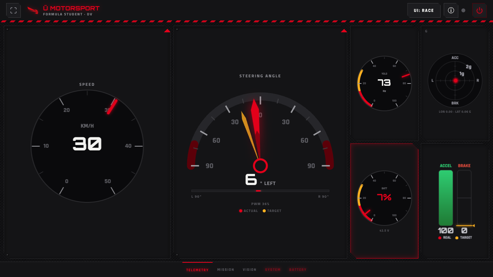
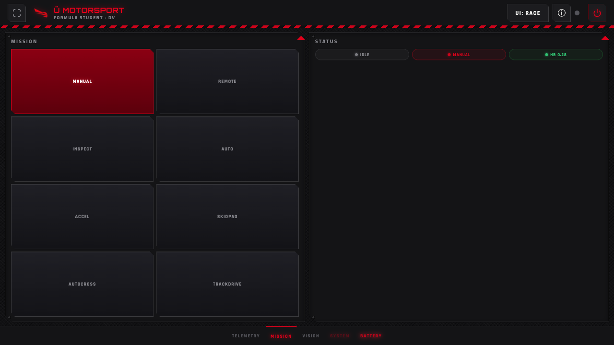
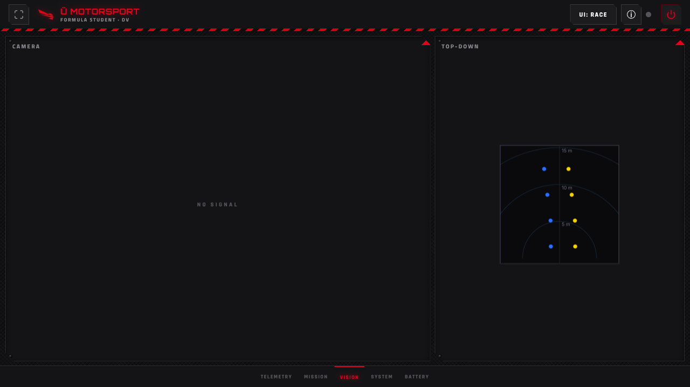
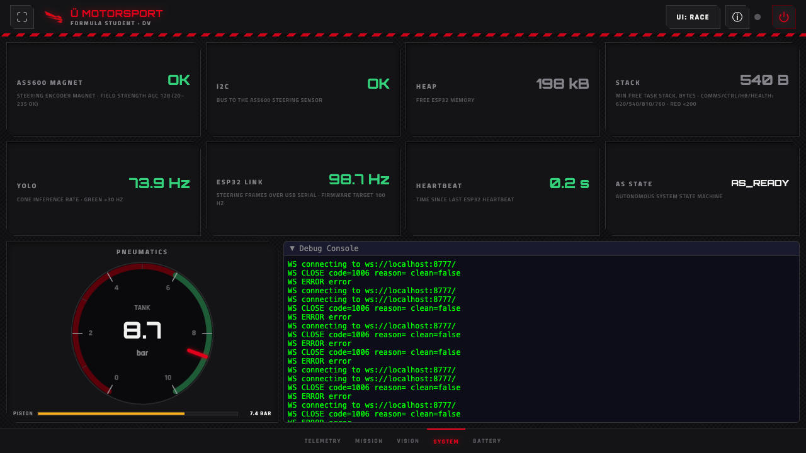
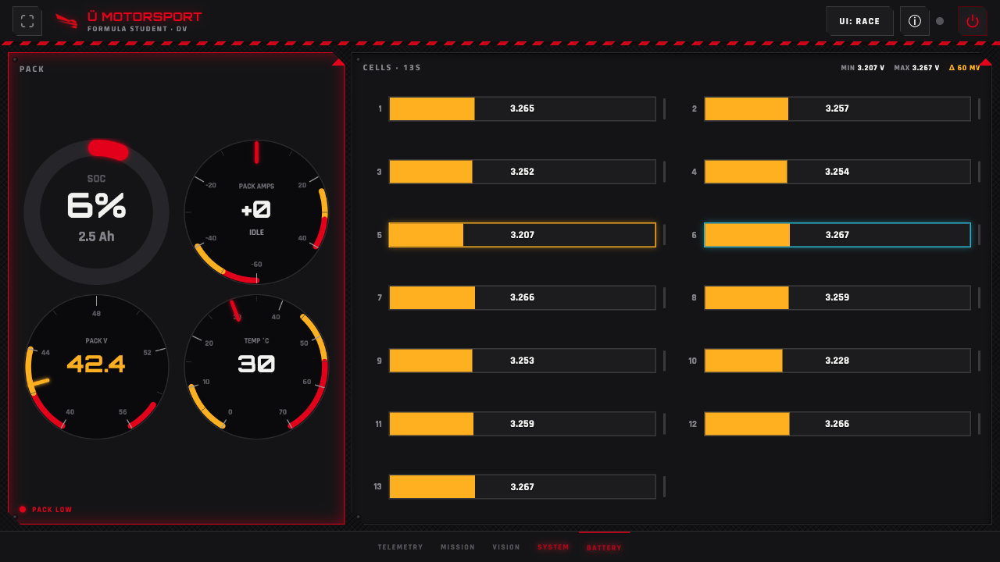

# Race Dashboard

The kart's live dashboard — a landscape "race skin" that a driver or engineer opens on a phone or laptop to watch telemetry and drive mission control. This page documents what each screen shows and where every value comes from, so another team can rebuild it.

## What it is

The dashboard is **not** a native GUI. It is a ROS 2 node (`kb_dashboard`, an `ament_python` package) that serves a single-page web app to any browser on the network. There is no framework and no build step: the whole UI is vanilla JavaScript with HTML `<canvas>`/SVG widgets, served by a hand-rolled asyncio HTTP + WebSocket server.

**Tech stack**

- **Node:** `kb_dashboard` — subscribes to ROS topics, writes a thread-safe `DashboardState`, and republishes it to browsers. <!-- dashboard_node.py -->
- **Transport:** one asyncio server (`server.py`) speaks both plain HTTP (serves `index.html`) and WebSocket (telemetry + commands). `broadcast_loop()` pushes a JSON snapshot to every connected browser at **10 Hz**; the HUD camera image is streamed separately as binary JPEG WebSocket frames at **~3.3 Hz** (every 3rd tick, JPEG quality 60). Browser → kart commands travel back over the same WebSocket. <!-- server.py broadcast_loop -->
- **UI:** `index.html` holds all skins inline. The dashboard is mounted landscape on a phone holder in the kart; the race skin is the default (stored in `localStorage`).

The 10 Hz broadcast rate is deliberate — human live-monitoring does not need more, and fast transients (impact/vibration spikes) are meant to be captured in a source-rate log on the Orin, not the live feed.

## How to run and access

```bash
ros2 launch kb_dashboard dashboard.launch.py
```

This binds **port 80** so URLs need no port suffix. A non-root process binding a port below 1024 requires `net.ipv4.ip_unprivileged_port_start=80` (one `sysctl` line). In production the node is not launched on its own — it starts as part of `kart-brain.service`, which runs `ros2 launch kart_bringup launch.py`.

**Access**

- On the `kart` Wi-Fi access point: **`http://10.42.0.1`**
- From anywhere over the internet (via cloudflared tunnel): **`kart.rubenayla.xyz`**

The topbar ⓘ button opens a popover fed by the node's `/network-info` endpoint, which lists the Orin's live LAN addresses so the local URL stays correct even if the address changes.

## Demo mode

Append **`?demo=1`** to the URL (e.g. `http://10.42.0.1/?demo=1`) to drive the entire UI from a simulated random-walk data source — needles move, cones drift past, the battery sweeps through its colour zones — with no ROS graph and no hardware. This is the standard way to work on the dashboard away from the kart.

!!! note "Screenshots below were captured in demo mode"
    Every value shown in the screenshots on this page is **synthetic**, generated by the `?demo=1` simulator. They illustrate layout and behaviour, not real kart readings.

## Layout

The race skin is **landscape only** and never scrolls. It is one full-screen stage with five swipeable pages, selected by a bottom tab bar or a horizontal swipe:

**Telemetry · Mission · Vision · System · Battery**

A portrait "rotate the phone — landscape only" guard covers the stage when the device is held upright (the topbar stays visible so you can still switch skins).

!!! info "Only the race skin is documented"
    `index.html` defines six skins (`race`, `legacy`, `kitt`, `tesla`, `hud`, `artemis`). The other five are portrait layouts still present in the code; only the landscape **race** skin — the default, and the one being actively maintained — is covered here.

### Global topbar (all pages)

Persistent across all five pages:

| Element | Shows |
|---|---|
| Brand | "Ü MOTORSPORT / FORMULA STUDENT · DV" with the team logo |
| Live pulse dot | WebSocket connection health (pulses red while connected) |
| Skin selector | Dropdown to switch UI skin |
| ⓘ network info | Popover with the Orin's live LAN IPs, from the `/network-info` HTTP endpoint |
| Power off | Powers off the Orin computer (double-confirmed; **not** the kart safety shutdown / EBS — Emergency Braking System) |

---

## Telemetry

The driving cluster: speed, steering, and four mini-instruments.



*Demo-mode data.*

| Widget | Shows | Data field → ROS topic |
|---|---|---|
| Speed dial | Speed in km/h | `esp32_speed` ← `/esp32/speed` (`Frame`, `decode_speed`) **or** `/kart/speed` (`Float32`, ZED VIO — visual-inertial odometry) — both write the same field |
| Steering gauge | Actual angle (red needle, ±90°), commanded target (amber ghost needle), and PWM % below | actual `esp32_steering_rad` ← `/esp32/steering`; target `orin_cmd_steering_rad` ← `/orin/steering`; PWM `esp32_steering_pwm` ← `/esp32/steering` |
| YOLO mini-dial | Cone-inference frame rate | `yolo_fps` ← `/perception/yolo/fps` (`Float32`) |
| G-G mini-plot | Lateral vs. longitudinal acceleration, in g | `esp32_accel_lat` / `esp32_accel_lon` ← `/esp32/acceleration` (`Frame`, `decode_accel`) **or** `/zed/zed_node/imu/data` (`Imu`) |
| Battery mini-dial | State of charge dial + pack voltage number | `battery_soc`, `battery_voltage` ← `/battery/state` (`BatteryState`) |
| Pedals dial | Throttle and brake pedal effort, plus commanded brake | `esp32_throttle` ← `/esp32/throttle`, `esp32_braking` ← `/esp32/braking`, `orin_cmd_brake` ← `/orin/brake` |

The steering sign follows the shared dashboard convention: positive radians render to the **right**.

---

## Mission

Mission selection and autonomous-system control.



*Demo-mode data.*

| Widget | Shows | Command → ROS topic |
|---|---|---|
| Mission grid (8 buttons) | Manual, Remote, Inspect, Auto, Accel, Skidpad, Autocross, Trackdrive | Selected mission string → `/dashboard/mission` (`String`) |
| Algorithms pane | Steering-controller and speed-controller dropdowns (hidden for Manual/Remote) | steering → `/dashboard/controller_type`; speed → `/dashboard/speed_controller_type` (`String`) |
| Status pills | State / Mission / Heartbeat, read-only | (display only — from the telemetry snapshot) |
| Controls | Start · Stop · EBS · Restart | Start/Stop/EBS → `/dashboard/state_cmd` (`String`, `start`/`stop`/`ebs`); Restart runs `systemctl restart kart-brain` on the Orin |
| Remote joystick | Touch joystick, shown only in the Remote mission | `/kart/cmd_vel_manual` (`Twist`) |

The eight mission buttons map to the mission keys in `protocol.py`'s `MISSIONS` table (`manual`, `remote_control`, `inspection`, `autonomous`, `acceleration`, `skidpad`, `autocross`, `trackdrive`). The Algorithms pane and the joystick pane appear only for the missions that use them — the grid re-flows so only visible panes share the width.

Only one browser holds the manual-control token at a time; others see who has control and can take it.

---

## Vision

What the perception pipeline sees.



*Demo-mode data.*

| Widget | Shows | Data field → ROS topic |
|---|---|---|
| Camera HUD | Live annotated camera stream; "NO SIGNAL" when absent | `/perception/hud` (`Image`) → re-encoded to JPEG and streamed as binary WebSocket frames |
| Top-down cone map | Cones plotted from above (x = lateral, z = forward), with 5 / 10 / 15 m range rings | `cones_3d_ground` ← `/perception/cones_3d_ground` (`Detection3DArray`) |

The top-down map prefers the IMU-corrected topic `/perception/cones_3d_ground`. If that topic has been silent for more than 1 s (it only runs in the ground-plane validation launch), the node falls back to the raw `/perception/cones_3d` so the view stays live under the default YOLO pipeline. <!-- dashboard_node.py _on_cones_3d_raw -->

---

## System

ESP32 and firmware health, pneumatics, and a debug console.



*Demo-mode data.*

| Card | Shows | Data field → ROS topic |
|---|---|---|
| AS5600 magnet + AGC | Steering-encoder magnet present, AGC (automatic gain control) field strength (20–235 ok) | `health_magnet_ok`, `health_agc` ← `/esp32/health` (`Frame`, `decode_health`) |
| I2C | Bus status to the AS5600, error count | `health_i2c_ok`, `health_i2c_errors` ← `/esp32/health` |
| Heap | Free ESP32 heap memory | `health_heap_kb`, `health_heap_ok` ← `/esp32/health` |
| Stack | Min free task stack (comms/control/heartbeat/health); red < 200 B | `stack_comms` / `stack_control` / `stack_heartbeat` / `stack_health` — **not wired yet, see below** |
| YOLO | Cone-inference rate; green > 30 Hz | `yolo_fps` ← `/perception/yolo/fps` |
| ESP32 link | Steering-frame rate over USB serial; firmware target 100 Hz | `esp_fps` ← `/esp32/fps` (`Float32`) |
| Heartbeat | Time since the last ESP32 heartbeat | `esp32_heartbeat_age` ← `/esp32/heartbeat` (`Frame`) |
| AS state | Autonomous-system state-machine state | `as_state` ← `/kart/state` (`String`) |
| Pneumatics dials | Tank pressure dial (6–10 bar safe band) + piston pressure bar | `pneu_tank_bar`, `pneu_piston_bar` — **not wired yet, see below** |
| Debug console | Relocated global debug log, expanded | (browser-side log) |

Any unhealthy item pulses the **System** tab red.

---

## Battery

The smart-BMS pack view, fed independently of the ESP32 link.



*Demo-mode data.*

| Widget | Shows | Data field → ROS topic |
|---|---|---|
| SOC ring | State of charge %, with remaining Ah as the sub-line | `battery_soc`, `battery_charge` ← `/battery/state` |
| Pack current gauge | Bidirectional current (− discharge / + charge), signed value in the centre | `battery_current` ← `/battery/state` |
| Pack voltage gauge | Pack voltage | `battery_voltage` ← `/battery/state` |
| Temperature gauge | Hottest cell temperature | `battery_temps` / `battery_temp` ← `/battery/state` |
| Per-cell strip | 13S per-cell millivolts, with min / max / imbalance (Δ) markers | `battery_cells_mv` ← `/battery/state` |

All battery fields come from `/battery/state` (`sensor_msgs/BatteryState`), published by the `kb_bms` node, which reads the JBD/Xiaoxiang smart BMS over Bluetooth Low Energy. The **Battery** tab pulses red (once pack voltage data is present) when the pack is worth flagging: **SOC < 15 %**, any **cell < 3.0 V**, **imbalance > 80 mV**, **temperature ≥ 55 °C**, or **pack current in its over-current (red) zone**. <!-- rcUpdateBattery in index.html -->

---

## Known gaps

Two System-page groups are drawn and are fed by demo mode, but have **no real ROS subscription** in `dashboard_node.py` yet, so on the real kart they read `--`:

- **Pneumatics** — `pneu_tank_bar` and `pneu_piston_bar` (tank + piston dials).
- **Stack** — `stack_comms` / `stack_control` / `stack_heartbeat` / `stack_health` (min free task stack).

The widgets exist and will start displaying as soon as those topics are published and subscribed.

## Related pages

- [ROS 2 Packages](ros2/packages.md) — the other nodes and topics `kb_dashboard` subscribes to and publishes.
- [Battery (BMS hardware)](../assembly/electronics/power/battery.md) — the pack and smart BMS behind `/battery/state`.
