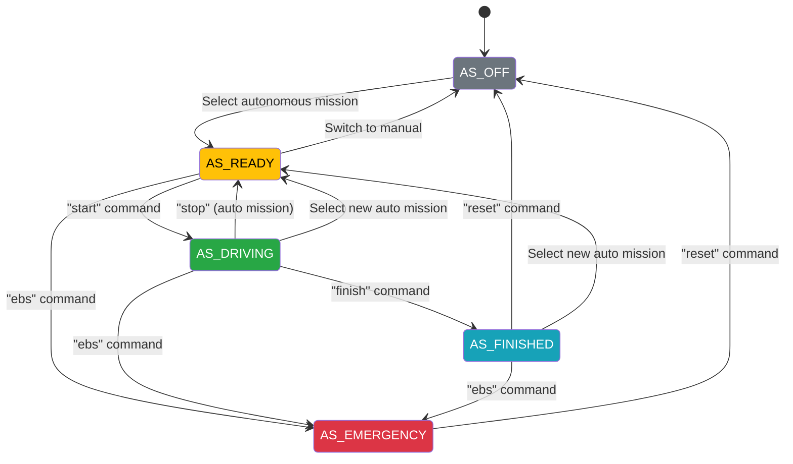

# State Machine

The state machine node (`state_machine_node.py`) is the central safety and control authority for the kart. It determines what drives the wheels by muxing `cmd_vel` based on two independent variables: the **mission** (what the kart should do) and the **AS state** (whether the autonomous system is allowed to drive).

**Source:** `src/kart_control/scripts/state_machine_node.py`

---

## Two Independent Variables

### Mission

The **mission** is selected from the dashboard. It determines the operating mode:

| Mission | Type | Description |
|---------|------|-------------|
| `manual` | Manual | Direct control via joystick/dashboard |
| `remote_control` | Manual | Same as manual (dashboard remote) |
| `throttle_test` | Test | Fixed 50% throttle for hardware debugging |
| `acceleration` | Autonomous | FS acceleration event |
| `skidpad` | Autonomous | FS skidpad event |
| `autocross` | Autonomous | FS autocross event |
| `trackdrive` | Autonomous | FS trackdrive event |
| `ebs_test` | Autonomous | Emergency braking system test |
| `inspection` | Autonomous | Technical inspection demo |

### AS State (Autonomous System State)

The **AS state** tracks the autonomous system lifecycle per Formula Student rules (T14.8):

| State | ID | Description |
|-------|----|-------------|
| `AS_OFF` | 0 | Autonomous system inactive |
| `AS_READY` | 1 | Armed and waiting for "Go" signal |
| `AS_DRIVING` | 2 | Autonomous driving active |
| `AS_FINISHED` | 3 | Mission complete, vehicle stopped |
| `AS_EMERGENCY` | 4 | Emergency braking activated |

---

## cmd_vel Mux Logic

The state machine selects which velocity command reaches the actuators:

| Mission | AS State | Output | Why |
|---------|----------|--------|-----|
| `manual` / `remote_control` | *any* | Manual cmd_vel | Operator has direct control |
| `throttle_test` | *any* | Fixed 50% throttle | Hardware test, no perception |
| Any autonomous | `AS_DRIVING` | Autonomous cmd_vel | Controller drives the kart |
| Any autonomous | *anything else* | Zero (stopped) | Safety: no motion unless AS_DRIVING |

!!! info "Key insight"
    AS state only matters for autonomous missions. Manual and throttle_test bypass it entirely -- the operator is always in control.

---

## State Transitions

### Transition Details

| Trigger | From | To | Notes |
|---------|------|----|-------|
| Select autonomous mission | `AS_OFF`, `AS_DRIVING`, `AS_FINISHED` | `AS_READY` | Auto-arms the system |
| Switch to manual | Any (except `AS_OFF`) | `AS_OFF` | Fully disarms |
| `start` | `AS_READY` | `AS_DRIVING` | Begin autonomous driving |
| `stop` (auto mission active) | `AS_READY`, `AS_DRIVING`, `AS_FINISHED`, `AS_EMERGENCY` | `AS_READY` | Stays armed |
| `stop` (manual mission) | Any | `AS_OFF` | Fully disarms |
| `ebs` | Any (except `AS_OFF`) | `AS_EMERGENCY` | Emergency braking |
| `finish` | `AS_DRIVING` | `AS_FINISHED` | Mission complete |
| `reset` | `AS_FINISHED`, `AS_EMERGENCY` | `AS_OFF` | Clear error/completion |

---

## ASSI (Autonomous System Status Indicator)

The ASSI communicates the AS state visually, as required by FS rules:

| State | ASSI Signal |
|-------|-------------|
| `AS_OFF` | Off |
| `AS_READY` | Yellow continuous |
| `AS_DRIVING` | Yellow flashing (2-5 Hz) |
| `AS_FINISHED` | Blue continuous |
| `AS_EMERGENCY` | Blue flashing (2-5 Hz) |

---

## Formula Student Competition Context

These states map to the **FS T14.8 AS Status** (Figure 15 in FS Rules 2026). See also the [rules reference](../rules/as_state_machine.md) for the full FS decision tree and hardware requirements.

In a real competition, additional checks gate each transition:

- **AS_READY** requires: mission selected + ASMS (Autonomous System Master Switch) on + ASB (Autonomous System Brake) checks OK + TS (Tractive System) active + brakes engaged
- **AS_DRIVING** (R2D — Ready to Drive) is triggered only via the RES (Remote Emergency System) "Go" signal, after 5 seconds in AS_READY
- The vehicle must not move until 3 seconds after entering AS_DRIVING

!!! warning "Current limitations"
    We simulate the RES "Go" signal with the dashboard "start" button since we don't have RES hardware yet. The 5-second AS_READY hold time and the 3-second AS_DRIVING standstill requirement are **not yet implemented**.

---

## ROS Topics

### Subscriptions (inputs)

| Topic | Type | Source | Purpose |
|-------|------|--------|---------|
| `/dashboard/mission` | `String` | Dashboard | Mission selection |
| `/dashboard/state_cmd` | `String` | Dashboard | Commands: start, stop, ebs, finish, reset |
| `/kart/cmd_vel` | `Twist` | Controller | Autonomous velocity command |
| `/kart/cmd_vel_manual` | `Twist` | Dashboard | Manual velocity command. The physical gamepad does **not** publish here — `joy_to_cmd_vel` publishes `/kart/cmd_vel`, the autonomous input |

### Publications (outputs)

| Topic | Type | Rate | Purpose |
|-------|------|------|---------|
| `/kart/cmd_vel_muxed` | `Twist` | 100 Hz | Final muxed velocity command |
| `/kart/state` | `String` | 10 Hz | Current AS state name (heartbeat) |
| `/orin/machine_state` | `Frame` | On change | AS state ID to ESP32 |
| `/orin/mision` | `Frame` | On change | Mission ID to ESP32 |
| `/orin/steer_mode` | `Frame` | On change | Steering mode (PID/PWM) to ESP32 |

---

## Implementation Notes

The node runs two timers:

- **100 Hz mux timer** (`_mux_tick`): Reads the current mission and state, selects the appropriate `cmd_vel` source, and publishes to `/kart/cmd_vel_muxed`.
- **10 Hz heartbeat** (`_publish_state`): Publishes the current state name so other nodes and the dashboard can monitor it.

State transitions are triggered by ROS topic callbacks, not by the timers. Each transition logs the change and publishes the new state to both ROS topics and ESP32 frames.

When an autonomous mission is selected, the node forces PID steering mode via `/orin/steer_mode` to ensure the ESP32 uses closed-loop steering control.
